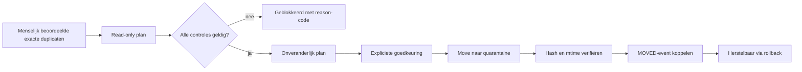

# SCRUM-104 — Gecontroleerde duplicate-cleanup-pilot

## Doel

CORE kan overtollige exacte kopieën uit een volledig beoordeelde duplicaatgroep
gecontroleerd naar één technisch quarantainegebied verplaatsen. Dit is een
herstelbare tussenstap en geen fysieke verwijdering.

Het enige doelgebied is:

```text
/volume1/data/.core/quarantaine/duplicaten
```

De leidende kopie blijft op haar bestaande locatie staan. De executor ondersteunt
geen purge- of deletecommando.

## Veiligheidsflow



## Toelatingsvoorwaarden

Een kopie komt alleen in aanmerking wanneer:

- SCRUM-110 een actuele menselijke leidende kopie heeft;
- `v_exact_duplicate_review_handoff` de overdracht expliciet toestaat;
- leidende en overtollige kopie nog bestaan en dezelfde SHA-256 en grootte hebben;
- beide kopieën binnen `/volume1/data` staan;
- de overtollige kopie nog niet in quarantaine of een actief cleanupplan zit;
- het quarantainepad vrij is;
- bron en doel op hetzelfde filesystem staan.

Backupkopieën buiten `/volume1/data` blijven in deze pilot buiten scope.

## Uitvoering

Pas eerst de migratie toe:

```bash
docker exec -i postgres psql -v ON_ERROR_STOP=1 -U hugo -d nasdb_test \
  < database/migrations/20260822_add_duplicate_cleanup_executor.sql
```

Begin altijd read-only:

```bash
core cleanup duplicates plan --limit 10 --dry-run
```

Maak pas na controle een onveranderlijk plan:

```bash
core cleanup duplicates plan --limit 10 --create-plan
core cleanup duplicates approve PLAN_ID --confirm PLAN_ID
core cleanup duplicates execute PLAN_ID --confirm PLAN_ID
core cleanup duplicates reconcile PLAN_ID
```

Herstellen naar de oorspronkelijke bronlocatie:

```bash
core cleanup duplicates rollback PLAN_ID --confirm PLAN_ID
```

## Audit en herstel

Plannen, items en statusovergangen zijn append-only. Per item bewaart CORE onder
andere de review-ID, contentgroep, beide file-ID's, SHA-256, grootte, oorspronkelijke
paden, quarantainepad, mtime, policyversie en actor. De watcher registreert de move;
reconciliation koppelt dit `MOVED`-event aan de CORE-operatie zonder het document
als actief te kwalificeren.

## Buiten scope

- fysieke verwijdering of purge;
- compressie;
- cleanup van bestanden buiten `/volume1/data`;
- near-duplicates;
- automatisch kiezen of wijzigen van het golden record;
- wijziging van classificatie, lifecycle of doelpad;
- cleanup van een groep waarvan alle kopieën weg mogen.
