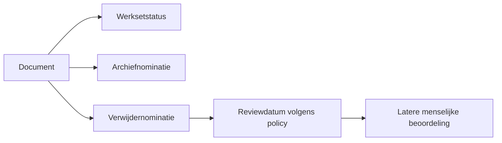

# SCRUM-104 — archief- en verwijdernominaties

Deze eerste retentieslice maakt het mogelijk om tijdens de portalbeoordeling vast
te leggen dat een document later voor archivering of verwijdering moet worden
beoordeeld. Een nominatie is **geen bestandsactie**.

## Drie onafhankelijke beslissingen

CORE houdt afzonderlijk bij:

1. of een document in de actieve werkset staat;
2. of het voor archivering is genomineerd;
3. of het voor een toekomstige verwijderreview is genomineerd.

Een actief document kan dus een verwijdernominatie hebben zonder inactief te
worden en zonder archiefnominatie. De portal wijzigt geen pad, bestand, hash,
werksetstatus of opslaglocatie.



## Veilige policy v1

De migratie activeert in acceptatie policy `document_retention`, versie
`retention-nomination-v1`. Deze policy:

- plant een archiefreview direct;
- plant een verwijderreview na 90 dagen;
- archiveert nooit automatisch na een verwijdernominatie;
- verplaatst of verwijdert geen bestanden;
- staat permanente verwijdering niet toe.

De 90 dagen is een reviewvenster, geen toestemming om het document na 90 dagen
te verwijderen. Uitgebreide termijnen per categorie en familie volgen in een
latere SCRUM-104-slice.

## Audit en intrekken

`document_lifecycle_nomination_events` is append-only. Intrekken maakt een nieuw
event dat naar het vorige event verwijst. De oorspronkelijke reden, policyversie,
classificatie, privacy en werksetstatus blijven daardoor controleerbaar.

De views zijn:

- `v_latest_document_lifecycle_nomination`: laatste besluit per document en type;
- `v_active_document_lifecycle_nominations`: momenteel geldige nominaties.

## Portal

Per document zijn twee onafhankelijke knoppen beschikbaar:

- **Archiveren** voor een archiefnominatie;
- **Nomineren voor verwijderen** voor een toekomstige verwijderreview.

De knop verandert na nominatie in een intrekbare status. Het nominatiefilter en
de tellers vormen het overzicht van documenten die voor archief of verwijdering
zijn genomineerd.

## Uitrollen in acceptatie

```bash
docker exec -i postgres psql -v ON_ERROR_STOP=1 -U hugo -d nasdb_test \
  < database/migrations/20260815_add_document_lifecycle_nominations.sql
docker compose up -d --build --no-deps dashboard
```

Rollback verwijdert de nominatie-opslag en views. De immutable policy snapshot
blijft bewust bestaan voor audit en forward recovery.
## Portaalgedrag

Een archief- of verwijdernominatie gebruikt geen browserpopup. Een eventuele
toelichting uit het bestaande notitieveld wordt als reden opgeslagen; zonder
notitie gebruikt CORE een neutrale auditreden. Na opslag blijft het document in
de huidige beoordelingslijst staan en toont de knop zelf duidelijk de actieve
markering. Nogmaals klikken trekt de nominatie append-only in. De nominatie
wijzigt het bestand en de actieve werksetstatus niet.
