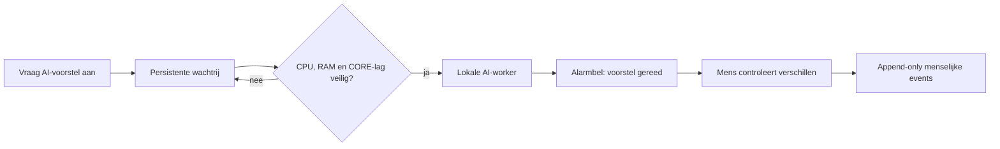

# SCRUM-106 — asynchrone AI-wachtrij

## Doel

Een lokaal AI-voorstel kan per document worden aangevraagd, ongeacht of het
document actief, inactief of nog te beoordelen is. De portalrequest wacht niet
op het model. De aanvraag wordt duurzaam opgeslagen en door één afzonderlijke
worker verwerkt.

## Prioriteit en begrenzing

De eerste versie verwerkt maximaal één taak tegelijk. Actieve documenten hebben
prioriteit 300, lifecycle-review 200 en inactieve documenten 100. Binnen één
prioriteit geldt de oudste aanvraag eerst.

De worker start geen volgende taak wanneer:

- genormaliseerde CPU-load boven `CORE_AI_MAX_CPU_PERCENT` ligt (standaard 70%);
- minder dan `CORE_AI_MIN_AVAILABLE_MIB` vrij geheugen resteert (standaard 3072 MiB);
- scanner-/metadata-streamlag hoger is dan `CORE_AI_MAX_STREAM_LAG` (standaard 1000).

Een wachtende job houdt een verklaarbare reason-code. De CORE-pipeline en portal
hebben altijd voorrang.

## Menselijke controle

De alarmbel toont nieuwe voorstellen. `Neem volledig AI-voorstel over` toont
eerst categorie, familie, privacy, lifecycle, confidence, reden, model en
promptversie. Na bevestiging schrijft CORE afzonderlijke append-only events voor
doelpad/classificatie, privacy en lifecycle. Het AI-resultaat zelf is geen
menselijk akkoord.

De worker en portal wijzigen, verplaatsen, hernoemen of verwijderen geen bestand.

### Taxonomie blijft leidend

De lokale LLM krijgt de toegestane categorie-familiecombinaties mee. CORE
valideert het antwoord daarna opnieuw. Als een familie precies één canonieke
categorie heeft, corrigeert CORE een afwijkende LLM-categorie verklaarbaar en
verlaagt een hoge confidence naar medium. Voorbeeld:
`mortgage_documents` wordt altijd `home_living` (`Wonen`) en nooit `finance`.
Bij een dubbelzinnige ongeldige combinatie onthoudt CORE zich en vraagt het om
menselijke beoordeling. Bestaande AI-runs blijven ongewijzigd voor audit.

### Lifecyclepolicy blijft leidend

De prompt bevat de actuele CORE-werksetstatus, activity reason-code, laatste
kwalificerende activiteit en de gebruikte datumbron. De LLM mag inhoudelijke
actualiteit signaleren, maar kan de configuration-driven werksetpolicy niet
overschrijven. Bij een afwijkend lifecycleadvies bewaart CORE de eigen status,
neemt het oorspronkelijke LLM-advies op in de reden en verlaagt high confidence
naar medium. Een menselijke lifecyclebeoordeling blijft de hoogste autoriteit.

## OCR-advies bij onleesbare inhoud

Voor de lokale AI wordt aangeroepen, probeert CORE eerst lokaal tekst uit het
document te halen. CORE raadpleegt daarvoor eerst bestaande `needs_ocr`-evidence
die bij exact dezelfde inhoudshash hoort. Als die evidence actueel is, wordt het
document niet opnieuw geopend en verschijnt `OCR vereist — reeds vastgesteld`,
inclusief lineage naar de eerdere semantic run.

Als nog geen evidence bestaat en een PDF of afbeelding geen herkenbare tekst oplevert,
wordt de AI-aanvraag controleerbaar afgerond met `OCR aanbevolen` en reason-code
`ocr_recommended_no_extractable_text`. Dit resultaat verschijnt zowel op de
documentkaart als in de alarmbel.

CORE start OCR niet automatisch. Na een gecontroleerde OCR-stap kan opnieuw een
AI-voorstel worden aangevraagd. Een leeg Word- of Excel-document krijgt alleen
`geen uitleesbare tekst`, omdat OCR daar normaal geen passende vervolgstap is.

### OCR handmatig starten

Bij een OCR-advies toont Workset de knop **OCR starten**. Deze maakt één
persistente, individuele OCR-taak aan. De zelfstandige `workset_ocr_worker`
verwerkt maximaal één PDF tegelijk met lokale Tesseract-herkenning (`nld+eng`).
Actieve documenten krijgen voorrang en de gewone CORE-pipeline behoudt
voorrang bij streamlag of weinig vrij geheugen.

De bron-PDF wordt read-only geopend en nooit aangepast. Herkende tekst wordt
gzip-gecomprimeerd opgeslagen onder `/volume1/docker/core-runtime/ocr`, genoemd naar de
inhoudshash. De database bewaart status, engineversie, taal, tellingen, hashes
en artifact-lineage, niet de tekst zelf. Na `OCR gereed` kan de gebruiker
expliciet **Vraag AI na OCR** kiezen; de AI-worker leest dan het lokale artifact.

Uitrol vereist migratie `20260821_add_workset_ocr_jobs.sql`, de afgeschermde
artifactmap `/volume1/docker/core-runtime/ocr` buiten de documentscan en het bouwen van `dashboard`,
`workset_ai_worker` en `workset_ocr_worker`. Standaard wacht OCR boven 60%
genormaliseerde CPU-load, onder 2048 MiB beschikbaar geheugen of bij te hoge
CORE-streamlag.

## Uitrol

1. Migratie `20260816_add_async_workset_ai_jobs.sql` toepassen.
2. Dashboard en `workset_ai_worker` bouwen.
3. Begin met tien expliciete aanvragen en controleer wachtrijprioriteit en resourcegates.
4. Pas grenswaarden pas aan na observatie in acceptatie.
