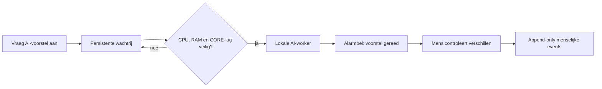

# SCRUM-106 — asynchrone AI-wachtrij

## Doel

Een lokaal AI-voorstel kan per document worden aangevraagd, ongeacht of het
document actief, inactief of nog te beoordelen is. De portalrequest wacht niet
op het model. De aanvraag wordt duurzaam opgeslagen en door één afzonderlijke
worker verwerkt.

## Prioriteit en begrenzing

De eerste versie verwerkt maximaal één taak tegelijk. Actieve documenten hebben
prioriteit 300, lifecycle-review 200 en inactieve documenten 100. Binnen één
prioriteit geldt de oudste aanvraag eerst.

De worker start geen volgende taak wanneer:

- genormaliseerde CPU-load boven `CORE_AI_MAX_CPU_PERCENT` ligt (standaard 70%);
- minder dan `CORE_AI_MIN_AVAILABLE_MIB` vrij geheugen resteert (standaard 3072 MiB);
- scanner-/metadata-streamlag hoger is dan `CORE_AI_MAX_STREAM_LAG` (standaard 1000).

Een wachtende job houdt een verklaarbare reason-code. De CORE-pipeline en portal
hebben altijd voorrang.

## Menselijke controle

De alarmbel toont nieuwe voorstellen. `Neem volledig AI-voorstel over` toont
eerst categorie, familie, privacy, lifecycle, confidence, reden, model en
promptversie. Na bevestiging schrijft CORE afzonderlijke append-only events voor
doelpad/classificatie, privacy en lifecycle. Het AI-resultaat zelf is geen
menselijk akkoord.

De worker en portal wijzigen, verplaatsen, hernoemen of verwijderen geen bestand.

## Uitrol

1. Migratie `20260816_add_async_workset_ai_jobs.sql` toepassen.
2. Dashboard en `workset_ai_worker` bouwen.
3. Begin met tien expliciete aanvragen en controleer wachtrijprioriteit en resourcegates.
4. Pas grenswaarden pas aan na observatie in acceptatie.
