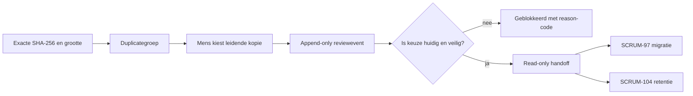

# SCRUM-110 — exacte duplicaten beoordelen

CORE toont exacte duplicaten als één groep in Workset. De gebruiker kiest één
leidende fysieke kopie. De beoordeling wordt append-only opgeslagen en verandert
geen bestand, pad of golden record.

## Functionele flow



De huidige golden-recordkeuze wordt in de portal gemarkeerd. Een andere fysieke
kopie mag worden gekozen, maar CORE past `content_groups.golden_file_id` niet
automatisch aan. De handoff blijft dan geblokkeerd met
`golden_switch_required` totdat een afzonderlijk gecontroleerd proces die keuze
heeft bevestigd.

## Veiligheidscontract

Een groep is alleen een veilige exacte duplicategroep wanneer minimaal twee
beschikbare bestanden dezelfde volledige `content_sha256` én grootte hebben.
Bestandsnaam, pad, inode, embeddings en inhoudelijke gelijkenis zijn niet
voldoende.

Vóór opslag wordt de actuele contentgroep opnieuw uit PostgreSQL gelezen. Een
gewijzigde hash, grootte, membership of beschikbaarheid blokkeert het oordeel.
De handoffview controleert dit daarna opnieuw en levert onder meer:

- geselecteerde en redundante file-ID's;
- bronpaden en voorgesteld quarantainepad;
- policy-ID en policyversie;
- `eligible_for_executor`;
- een verklaarbare `handoff_reason`.

Het enige toegestane quarantainepad is:

```text
/volume1/data/.core/quarantaine/duplicaten
```

Compressie en gelaagde quarantaine vallen buiten deze versie. SCRUM-110 maakt
geen lifecycle- of retentie-event aan en verplaatst of verwijdert niets. De
views vormen uitsluitend de gevalideerde overdracht naar SCRUM-97 en SCRUM-104.

## Schema installeren

```bash
docker exec -i postgres psql -v ON_ERROR_STOP=1 -U hugo -d nasdb_test \
  < database/migrations/20260821_add_exact_duplicate_review.sql
```

Rollback is alleen bedoeld zolang er nog geen waardevolle reviewhistorie is:

```bash
docker exec -i postgres psql -v ON_ERROR_STOP=1 -U hugo -d nasdb_test \
  < database/migrations/rollback/20260821_add_exact_duplicate_review.sql
```

Daarna wordt alleen het dashboard opnieuw gebouwd. De duplicate-review staat als
uitvouwbaar onderdeel in Workset en toont te beoordelen, beoordeelde of alle
groepen, de potentiële ruimtebesparing en de status van de veilige handoff.

## Append-only historie

Een nieuwe keuze overschrijft niets. Intrekken schrijft eveneens een nieuw event
met een verwijzing naar het vorige event. Idempotency keys voorkomen dubbele
opslag door een herhaald browserverzoek. Een wijziging aan een betrokken bestand
maakt een eerder besluit niet stilzwijgend geldig; de handoff meldt dan
`duplicate_changed_after_nomination` of `duplicate_evidence_changed`.

## Scopegrens

- geen filesystem-move, rename of delete;
- geen wijziging van golden records;
- geen automatische lifecyclewijziging;
- geen automatische retentienominatie;
- geen modeltraining;
- geen besluit op near-duplicates.

