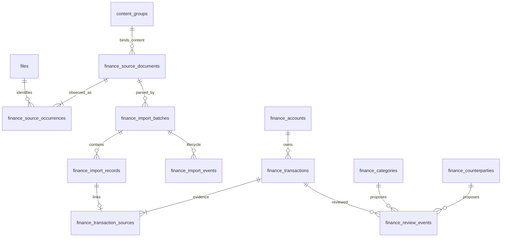

# SCRUM-118 — CORE Finance: analyse en fundament

Status: ontwerpvoorstel, ontwikkelronde 1, 16 september 2026. Geen ingest, schemawijziging, dashboard of AI geïmplementeerd. Eigenaar heeft expliciet aangegeven dat bankinformatie niet door ChatGPT mag worden ingelezen: verdere broninspectie is gestopt; ontwikkeling gebruikt uitsluitend synthetische data.
Uitgangspunt: [SCRUM-118](https://hugohoogendoorn.atlassian.net/browse/SCRUM-118), inclusief volledige beschrijving, alle velden, lege commentaar-/bijlagenlijsten en alle 20 bestaande kinderen (5 features, 15 stories).
Repositorybasis: `e8a58e6c4a1b417543464dfa37aade8eb2f8ec3d`.

## 1. Besluit en scope

Finance wordt een afzonderlijk domein bovenop CORE-documentidentiteit. `files.id` blijft documentidentiteit; `content_groups` blijft de registratie van identieke volledige bestandsinhoud. Finance bewaart financiële feiten en herkomst, niet een tweede catalogus van bestanden. De eerste implementatie is SCRUM-126: een getest schema en ingestcontract met uitsluitend synthetische gegevens. Werkelijke ASN-import volgt pas na verificatie van formaat én privacymaatregelen.

Bronnen en bankfeiten zijn onveranderlijk. Correcties, classificaties, duplicatebesluiten en terugdraaiingen zijn nieuwe events. Deterministische adapters leveren feiten; AI mag later uitsluitend voorstellen leveren. Ingest schrijft afgeleide gegevens, maar voert geen betalingen, bestandsverplaatsingen, verwijderingen of automatische overschrijvingen uit.

## 2. Gecontroleerde bestaande aansluitpunten

| Onderdeel | Bewijs in repository / read-only database | Finance-aansluiting en aandachtspunt |
| --- | --- | --- |
| Documentidentiteit | `metadata_worker.py`; live `files.id integer`, unieke `files.path`, `deleted_at`, `source`, MIME/extensie | FK naar bestaande ID; pad is locatie, geen identiteit. Nieuwe bronnen eerst via CORE registreren. |
| Inhoud | `core/integrity/golden_record.py`, `20260727_add_content_groups.sql`; live unieke `(content_sha256,size_bytes)` | Gebruik volledige SHA-256 + grootte. `hash_content` wordt uit de eerste 1024 bytes berekend en is ongeschikt voor Finance-deduplicatie. |
| Historie en locatie | `file_events`, `v_file_events_effective`, `20260908_add_workset_source_context.sql`, `20260916_prefer_newer_move_event_for_workset_location.sql` | Bewaar source-event-ID indien aanwezig. Historische OneDrive-context is bewijs, geen leespad. Resolve huidige locatie via CORE; controleer inhoud opnieuw bij ingest. |
| Workset | `core/workset/active_workset.py`, `v_active_document_workset`, `v_effective_document_workset`, `dashboard/static/workset.js` | Bestaande detail-/broncontext hergebruiken. Finance-lidmaatschap niet afleiden van alleen actieve/golden-documentselectie: ook gearchiveerde bronnen blijven relevant. |
| Classificatie | `classification_runs`, `classification_proposals`, `classification_reviews`, `v_current_file_classification` | Bestaande documentclassificatie blijft documentniveau; financiële categorieën horen bij transacties. Geen bedragen of omschrijvingen in generieke metadata stoppen. |
| Reviews | `20260811_add_document_review_events.sql` en latere uitbreidingen | Hergebruik contractpatroon: actor, versie, idempotency, supersedes en projectie. Bestaande tabel verplicht file/content-group en ondersteunt documentreviews; transactie-events krijgen domeintabel, documentreviews blijven bestaande events. |
| Append-only afdwinging | `20260829_add_controlled_execution_queue.sql` heeft mutation-reject triggers | Dit patroon gebruiken, plus beperkte rollen en TRUNCATE-rechten. Het label “append-only” alleen is onvoldoende: OCR-jobstatus wordt bijvoorbeeld wel bijgewerkt. |
| Workers | `workset_ai_worker.py`, `workset_ocr_worker.py` | Eén job tegelijk, PostgreSQL-claim met `FOR UPDATE SKIP LOCKED`, Redis-heartbeat, CPU/geheugen/streamlag/servicegate. Finance geen AI-uitzondering geven die handmatige jobs CPU-druk laat passeren. |
| Gecontroleerde uitvoering | `v_controlled_execution_batch_progress`, `controlled_execution_worker.py` | Heeft prioriteit boven ingest; reservering/gate moet ook race tussen check en claim voorkomen. |
| Pulse | `dashboard/app.py`: `heartbeat_service`, services-lijst, AI/OCR-statusaggregaties | Registratie Finance-service plus beperkte queue-aggregaties expliciet toevoegen; dit gebeurt niet automatisch door een Compose-service toe te voegen. |
| Migraties | `database/migrations/`, bijbehorende `rollback/`, `tests/integration/workset-source-context/` | Forward, rollback en echte PostgreSQL-integratietests, niet alleen SQL-teksttests. |
| Privacy | `core/organization/privacy_classification.py`, SCRUM-99-documentatie, `docker-compose.yml` | Bestaand financieel label minimaal medium, geen ACL. Brede `/volume1:ro`-mounts en generieke AI/OCR-paden zijn geen Finance-isolatie. In `dashboard/app.py` geen app-level auth-dependency aangetroffen; eventuele proxy-auth niet geverifieerd. |

### Hergebruik als harde ontwerpkeuze

De eigenaar wil maximaal voortbouwen op CORE, inclusief privacy. De actuele code gaat verder dan de oorspronkelijke SCRUM-99-documentatie: `document-privacy-v4` herkent onder meer IBAN-signalen en persoonlijke financiële context; `metadata_worker.persist_privacy_evidence` bewaart signaalcodes zonder de gevoelige waarden in `file_privacy_evidence`. `dashboard.app.effective_privacy_proposal` combineert die evidence met classificatie; menselijke privacyreviews worden in de bestaande Workset toegepast. Dit blijft de enige documentprivacyketen.

- Privacylabels blijven `low/medium/high`; geen Finance-specifieke tweede schaal, privacydatabase of documentreview-UI. Finance-bronnen krijgen via bronpolicy vooraf high als beschermingsminimum; zo hoeft eerst geen inhoud uitgelezen te worden. Bestaande menselijke reviews blijven intact; een lager oordeel kan de Finance-verwerkingsrestrictie niet impliciet opheffen.
- `policy_versions` / `v_current_policies` uit SCRUM-92 beheren versiegebonden Finance-bronbeleid en toegestane verwerking per omgeving. Bestaande retention- en controlled-execution checks uitbreiden voor beschermde bronnen; geen tweede policyengine. Hostpaden, secrets en containerconfig blijven deploymentconfig, conform bestaand policycontract.
- `external_llm_content_allowed=False` hergebruiken als beleidsuitkomst, met expliciete controle vóór contentextractie en modelaanroep. Het huidige teruggegeven veld alleen bewijst nog geen afdwinging in alle consumers. Voor Finance ook lokale AI/OCR standaard uit totdat eigenaar anders kiest.
- Bestaande documentevents, contentgroepen, privacy-evidence, documentreviews en bronopenfunctionaliteit hergebruiken. Alleen transactiespecifieke classificatie/reviewevents toevoegen omdat de bestaande documenttabel een file/contentgroep en documentreviewtype vereist.
- Workermeetfuncties, claimpatroon, onderhouds-/executiongate en Pulse-contract hergebruiken. Alleen Finance-queue, adapter en ontbrekende gezamenlijke admission/fencing toevoegen; geen parallelle scheduler of monitoringstack.
- Bestaande auth-, sleutel- en back-upvoorzieningen waar daadwerkelijk beschikbaar integreren. Ontbrekende afdwinging eerst aantonen en gericht aanvullen; geen complete nieuwe securitystack bouwen op basis van aannames. Regressietests beschermen bestaande Workset/privacyfunctionaliteit.

Live inspectie op `nasdb_test` in container `postgres` gebruikte alleen READ ONLY-transacties, `statement_timeout=8s`, en voor vervolgqueries `lock_timeout=500ms`. Alleen catalogusgegevens en geaggregeerde bestandsmetadata zijn getoond; geen rekeningnummers, volledige paden, namen van tegenpartijen of transactierijen. Er bestaan nog geen `finance*`-tabellen. Lokale schema-dumps zijn niet als actuele databasewaarheid aangenomen.

## 3. Beschikbare bronnen: bewezen versus nog onbekend

Metadatafilter: afzonderlijk woord ASN in bestandsnaam of ASN-padsegment; aanvullende zoekslag op bank/financiële exportnamen en extensies. Beschikbaarheid daarna met `is_file()` op geregistreerd pad in bestaande dashboardcontainer gecontroleerd. Geen bestandsinhoud geopend, gehasht, geparseerd of naar een model gestuurd.

| Selectie | Wat de reeds uitgevoerde metadata-inspectie bewijst |
| --- | --- |
| ASN-naam + PDF | PDF-kandidaten bestaan; nog geen bewijs dat elke PDF transacties bevat of tekstueel parseerbaar is. |
| ASN-naam + XML | XML-kandidaten bestaan; CAMT-namespace, versie en documentsoort onbekend. |
| Bank-/exportnaam + CSV, zonder expliciete ASN-match | CSV-kandidaten bestaan; bank, separator, encoding en kolommen onbekend. |
| Bank-/exportnaam + STA, zonder expliciete ASN-match | STA-kandidaten bestaan; MT940 niet bewezen door extensie alleen. |

Ook afbeeldingen, DOCX, JS en extensieloze ASN-naammatches gevonden: deze zijn geen bewezen bankexports. Historische/deleted registraties zijn niet meegeteld als beschikbare bron. De zoekslag is begrensd tot CORE-geregistreerde kandidaten, geen volledige NAS-/Downloads-inventaris. Geen bewijs van ASN-CSV betekent dus niet dat zulke downloads ontbreken.

De eigenaar wil geen bankinformatie door ChatGPT laten inlezen. Daarom geen verdere inspectie, geen verzoek om paden of voorbeeldbestanden, en geen automatische lokale tool waarvan bankinhoud via tooloutput alsnog in de agentsessie belandt. Werkelijke aantallen, bestandsnamen, hashes en paden worden niet in dit ontwerp of Jira gepubliceerd.

De eigenaar heeft inmiddels zelf een afzonderlijke `data/import/finance`-invoerlocatie aangewezen. Dit past bij de bestaande CORE-importstructuur; geen alternatief nodig. Het concrete UNC-/hostadres blijft lokale configuratie, buiten Jira en deze repositorydocumentatie. De vertaling naar een NAS-containerpad is nog niet gecontroleerd. De map is niet geïnspecteerd. Maak Finance-sourcepolicy, bestaande scanner/metadataworker-gates en bronbehoud effectief **vóór** onboarding: bestaande scanroots omvatten de algemene dataroot, dus een mapnaam alleen voorkomt geen automatische inhoudsextractie. Geen tijdelijke auto-delete-inbox en geen automatische verplaatsing van deze bronnen naar een los register.

SCRUM-150 levert later een offline, read-only hulpmiddel dat de eigenaar zelf buiten de agentsessie kan uitvoeren; eerst ontwikkelen/testen op synthetische data. Geen telemetrie, crashupload of inhoudslogging. Private padinvoer niet via shell-history. Het volledige resultaat blijft lokaal; desgewenst bevestigt de eigenaar alleen een generieke profielcode. Formaatprofiel omvat encoding, delimiter, quoting, decimaal-/datumconventies, debit/credit, ID-betrouwbaarheid, rekening-/valutavelden, paginering/totalen en bronlocators. Tot die gate is geslaagd blijft echte ingest uit. Schemawerk kan zonder dit antwoord verder; het precieze ASN-dialect blijft bewust onbeslist.

## 4. Voorgesteld datamodel (nog geen DDL)

Plaatsing: afzonderlijk PostgreSQL-schema `finance` met expliciete rollen en `finance_*`-tabellen, verwijzend naar `public.files` en `public.content_groups`. Geen wijziging van generieke documenttabellen voor financiële velden. UUID-PK's behalve bestaande CORE-ID's; UTC `timestamptz` voor events, bankdatums als `date`. `scope_id` is een stabiele UUID voor de eigenaar/administratie, server-side uit autorisatiecontext, nooit een vrij te kiezen clientfilter. Eén initiële scope; voorbereid op meerdere administraties zonder te claimen dat bestaande CORE reeds multitenant is.

Alle domein-FK's gebruiken `(scope_id,id)` met overeenkomstige UNIQUE-constraint om kruisende scopes te blokkeren. CORE-FK's krijgen `ON DELETE RESTRICT`; geen cascade die financieel bewijs verwijdert. Autorisatie controleert óók toegang tot het gerefereerde CORE-document. Historische inhoudshash is een snapshot, geen FK naar de mutable huidige `files.content_sha256`.

| Tabel | Minimale velden naast ID/scope/created_at | Relaties en constraints |
| --- | --- | --- |
| `finance_accounts` | identifier_scheme, identifier_ciphertext, identifier_hmac, key_version, institution_code nullable, display_label_ciphertext, default_currency nullable | UNIQUE(scope, identifier_scheme, identifier_hmac, key_version). IBAN optioneel; ook lokale/providerrekening. Canonieke account-ID blijft stabiel bij sleutelrotatie. Rekeningidentiteit nooit wijzigen; alias-/rotatieprocedure bewaart oude lookup tijdens overgang. |
| `finance_import_batches` | source_document_id, adapter_id/version, contract_version, normalization_version, config_digest, reprocess_revision, batch_key, requested_by | UNIQUE(scope,batch_key). Eén broninhoud per batch; meerdere rekeningen binnen bron toegestaan. Geen bankgegevens in config_digest. Normale retries blijven dezelfde batch. |
| `finance_source_documents` | content_group_id, anchor_file_id, content_sha256, size_bytes, format_family, format_profile_version nullable, origin_kind | UNIQUE(scope,content_sha256,size_bytes); hash 64 hex, grootte >0. CORE-groep moet overeenkomen met hash/grootte; afdwingen via gecontroleerde insertfunctie/trigger omdat CHECK geen andere tabel raadpleegt. Alleen bronbinding, geen eigen opslagcatalogus. |
| `finance_transactions` | account_id, booking_date, value_date nullable, amount numeric(24,8), currency char(3), bank_id_namespace nullable, bank_id_hmac nullable, candidate_fingerprint, fingerprint_version, source_description_ciphertext, source_counterparty_ciphertext, source_counteraccount_ciphertext, booking_status | Onveranderlijke bankfeiten. Valuta via versiegebonden allowlist; bedrag eindig, geen float, geen stille afronding. Pending later apart; eerste import alleen booked. Tegenpartij/category zijn effectieve eventprojecties, geen overschreven bronfeit. |
| `finance_counterparties` | display_name_ciphertext, identifier_scheme nullable, identifier_hmac nullable, identifier_ciphertext nullable, key_version | Naam alleen nooit unieke identiteit. Gedeelde IBAN bewijst geen gelijk persoon. Automatische samenvoeging alleen met gevalideerde domeinregel; overige gevallen voorstel. |
| `finance_categories` | code, label, parent_id nullable, taxonomy_version | UNIQUE(scope,taxonomy_version,code), FK parent in dezelfde scope/versie, geen cycli. Versies append-only; geen wijziging historische categoriebetekenis. |
| `finance_review_events` | transaction_id, review_type, decision, actor_id/type, contract_version, rule_version nullable, category_id nullable, counterparty_id nullable, correction_ciphertext nullable, supersedes_event_id nullable, expected_previous_id nullable, idempotency_key, payload_digest, sequence_no | FK transactie, categorie/tegenpartij. UNIQUE(scope,idempotency_key), UNIQUE(scope,transaction_id,review_type,sequence_no). Supersedes moet dezelfde transactie/type/scope betreffen; één opvolger per event. Geen lost updates: lock per transactie/type en compare-and-append. |

Aanvullende relaties zijn noodzakelijk: een transactie kan in meerdere exports voorkomen, een identiek bestand kan meerdere CORE-ID's hebben, en afgewezen bronregels mogen niet verdwijnen.

| Tabel | Doel en belangrijkste constraints |
| --- | --- |
| `finance_source_occurrences` | source_document_id, file_id, source_event_id nullable, observed_at; UNIQUE(scope,source_document_id,file_id). Bestaande CORE-identiteiten van alle aangeboden kopieën behouden; elke ontvangst als importevent, niet telkens nieuwe occurrence. |
| `finance_import_records` | batch_id, record_locator, observation_key, account_id nullable, outcome, error_code nullable, normalized_payload_ciphertext nullable. UNIQUE(scope,batch_id,record_locator). Parserlocator verplicht, foutcode uit allowlist; afgewezen/ambigue regels tellen mee. Evidence append-only, actuele outcome via events. |
| `finance_transaction_sources` | transaction_id, import_record_id, source_occurrence_id. Zelfde scope en consistent batch/source-document verplicht. Eén initieel transaction-link per record; remapping via reviewevent. Meerdere records mogen naar één transactie verwijzen. Geen transactie publiceren zonder bronlink, via deferred constraint trigger/atomische commit. |
| `finance_import_events` | batch_id, record_id nullable, event_type, sequence_no, actor, error_code, counts, idempotency_key, payload_digest. UNIQUE(scope,batch_id,sequence_no) en UNIQUE(scope,idempotency_key). Voorganger/lifecycle-validatie onder batchlock; geen ruwe exceptiontekst. |
| `finance_duplicate_events` | record_id, candidate_transaction_id, decision (same/distinct/unresolved), basis/version, actor, supersedes, idempotency_key. Reviewbesluit bepaalt koppeling; kandidaatfingerprint zelf is nooit UNIQUE. |
| `finance_ingest_jobs` (operationeel, fase 3) | batch_id UNIQUE, status, lease_token, lease_until, retry_at, attempt_count, waiting_reason. Mutable schedulerprojectie, bankfeiten/events blijven immutable. Claims fenced; afgeronde batchstatus en bronlinks in één DB-transactie. |

Official-ID-index: partieel UNIQUE `(scope_id,account_id,bank_id_namespace,bank_id_hmac)` waar ID niet NULL. Alleen vullen wanneer adapterprofiel uniciteit binnen account/namespace garandeert. Een end-to-end-referentie of `NOTPROVIDED` is niet vanzelf een banktransactie-ID. Bijzelfde ID met andere financiële feiten: conflict in importrecords, geen overschrijving van transactie.

Direction volgt het teken van bedrag vanuit de rekening. Eigen overboekingen blijven twee bankfeiten; transferclassificatie koppelt die later via events, zodat netto-analyses niet alle credits als inkomen interpreteren. Bewaar native currency; geen automatische FX-conversie. Bronbeschrijving exact behouden naast een aparte normalisatie voor matching.

## 5. Ingestcontract en idempotency

Input: scope uit geauthenticeerde context, CORE file-ID, verwachte volledige contenthash/grootte, adapterprofiel, contract-/normalisatieversie, actor en request-idempotency-key. Geen willekeurig pad van client openen. Dispatcher controleert toegang, bronbescherming, huidige locatie en hash/grootte voor én na de begrensde parse; wijziging tijdens lezen maakt de import ongeldig. Gebruik stabiele open file descriptor waar mogelijk, weigering symlinks/path traversal en allowlisted roots.

Adapteroutput: bronmetadata plus geordende records met locator, rekeningreferentie, booking/value date, exact decimal-string bedrag, valuta, booked/pending, bronvelden, mogelijke bank-ID met namespace en bewijsniveau, statement-ID/sequence indien echt aanwezig, controles en getypeerde fouten. Geen writes, netwerktoegang, categorisatie of AI binnen adapter. Opslaglaag valideert contract en voert atomische commits uit.

Canonicalisatie `finance-key-v1`: UTF-8 canonical JSON met lexicografisch gesorteerde veldnamen, vaste types, expliciete NULL versus lege tekst, ISO-datums, decimaal als canonieke string (geen exponent/-0), Unicode NFC. Lengtes/velden ondubbelzinnig; geen stringconcatenatie zonder framing. Rekeningnormalisatie is scheme-specifiek; IBAN hoofdletters en spaties verwijderen pas na validatie. Beschrijvingsmatching behoudt cijfers/interpunctie; alleen profielgedefinieerde whitespace-normalisatie. Bronwaarde blijft ongewijzigd.

| Niveau | Stabiele sleutel | Gedrag |
| --- | --- | --- |
| Exact bronduplicaat | scope + volledige SHA-256 + bytegrootte | Eén Finance-source-document; meerdere CORE-occurrences. Kopiëren/hernoemen maakt geen nieuwe import. Geen fuzzy/OCR-hash als exact bewijs. |
| Request | scope + client idempotency-key, met payload_digest | Zelfde key/body levert bestaande uitkomst. Zelfde key/andere body is conflict, nooit stil accepteren. |
| Batch | SHA-256 canonical(scope, source-content-key, adapter/version, contract, normalization, config_digest, reprocess_revision) | Retries/concurrent aanbod dezelfde batch. Versiewijziging kan nieuwe batch geven, geen nieuwe economische transactie. Reprocess-revision alleen expliciet, auditeerbaar. |
| Bronobservatie zonder bank-ID | HMAC(scope, source-content-key, locator_schema, record_locator) | Identificeert dezelfde bronrecord bij retries. CSV: logisch recordnummer + fysieke begin/eindregel; XML: statement/entry/detail-index en namespace; MT940: statement/block/entry-index; PDF: pagina, tabel, rij en zo nodig bounding box. Locators bevatten geen IBAN. |
| Officiële transactie-ID | account + namespace + HMAC(ID) | Enige automatische cross-export identity wanneer profiel uniciteit aantoont. Identieke feiten linken; afwijking blokkeert betrokken regel. |
| Kandidaat zonder bank-ID | HMAC(scope, account_id, booking_date, value_date, signed amount, currency, normalized counteraccount, reference, description), versioned | Niet-unieke index voor review/matching. Twee echte gelijke betalingen blijven afzonderlijke observaties. |

HMAC gebruikt domeinscheiding en een beheerde secret buiten database/Git; hashes zijn pseudoniemen, geen anonimisering. Key-version opslaan. Rotatie gebruikt gecontroleerde dual lookup en migratie/aliasmapping vóór activering; simpel een nieuwe key kiezen zou deduplicatie breken. Canonieke UUID-identiteiten blijven ongewijzigd.

Zonder officiële ID is perfecte herkenning tussen willekeurige overlappende exports niet bewijsbaar. Veilig contract: heraanbod van dezelfde bron is exact idempotent. Bij overlap worden records met bestaande kandidaatfingerprint **niet als nieuwe gepubliceerde transacties toegevoegd en ook niet stil samengevoegd**: ze blijven unresolved importrecords tot bewijs of review. Daarmee ontstaan geen stille dubbele totalen, maar wel zichtbaar onvolledige imports. Binnen één export houdt elke afzonderlijke locator zijn eigen multipliciteit. Een stabiele statement-ID + entrysequence kan alleen als sterke identiteit dienen wanneer het profiel stabiliteit over herexports heeft aangetoond. Sorteervolgorde/rank binnen een willekeurige export is geen bank-ID.

Een nieuwe parserversie die dezelfde bronlocator anders interpreteert maakt een conflict-/correctievoorstel, geen overschrijving. Veranderde locator-schema's vereisen expliciete mapping of review. “Uniek conflict → DO NOTHING” is onvoldoende: vergelijk payload en leg bronlink/conflict vast. Serialize matching per account in korte transacties, gebruik database-UNIQUE als laatste bescherming en begrensde retries bij deadlock/serialization-failure. Lease fencing voorkomt commits door verlopen workers.

## 6. Lifecycle, fouten en terugdraaien

Ontvangsten, validatie, recordbesluiten en batchstatus zijn events met monotone sequence, nooit sortering op willekeurige UUID als betekenisvolle volgorde. Operationele states `pending/running/paused/retry_wait/dead_letter` staan los van domeinlifecycle.

| Status | Betekenis en toegestane overgang |
| --- | --- |
| `received` (ontvangen) | CORE-bronbinding en batch vastgelegd; naar validated of rejected. Infrastructuurfout pauzeert/retryt de job zonder valse domeinreject. |
| `validated` (gevalideerd) | Formaat, privacygate, rekening, valuta, bronintegriteit en vereiste bestandscontroles akkoord; naar imported/partial/rejected. |
| `imported` (geïmporteerd) | Alle relevante records verantwoord: nieuw of bewezen duplicaat. Bronlinks, recordevents en commit-event atomisch; nul nieuwe transacties kan toch geslaagde duplicate-import zijn. |
| `partial` (gedeeltelijk) | Sommige records gepubliceerd, overige afgewezen/unresolved. Alleen als profiel onafhankelijke recordcommit expliciet toestaat en bestandscontroles geslaagd zijn. Review/resume kan naar imported; compenseren naar rolled_back. |
| `rejected` (afgewezen) | Geen records gepubliceerd; onbekend formaat, onbetrouwbare totalen, ongeldige header, source-changed, privacygate of fatale structurele fout. Herstel via expliciete nieuwe revision, oorspronkelijke afwijzing blijft. |
| `rolled_back` (teruggedraaid) | Expliciet geautoriseerde compensatie-events voor imported/partial. Niets verwijderd; retry van oude request reactiveert niets. Nieuwe opname via expliciete revision en review. |

Default is bestandsatomaire import. Partial alleen opt-in per bewezen profiel; niet gebruiken om een falende saldo-/totalencontrole te omzeilen. Een inconsistent bank-ID blokkeert minimaal die record en bij atomair profiel het gehele bestand. Controleer aantallen, periode, rekening/valuta, totaal debit/credit en begin/eindsaldo waar bron die werkelijk levert. Ontbrekende totalen is “not available”, geen geslaagde saldocontrole. Fouten bevatten alleen codes en locators; geen raw row of SQL-parameters.

Bronrecords kunnen staged worden voor hervatting, maar verschijnen pas in de effectieve transactieweergave na commit-event. Crash vóór commit laat geen gedeeltelijk gepubliceerde transactie achter; crash na commit vóór ack levert bij retry dezelfde uitkomst. Tijdelijke DB/Redis/storageproblemen krijgen backoff met jitter, begrensde pogingen en zichtbaar dead-letter-resultaat. Handmatige retry auditeert actor/reason. Ongeldige input niet eindeloos retryen.

Batchcompensatie trekt uitsluitend de bijdrage van die batch terug. Een transactie met andere actieve bronbewijzen blijft zichtbaar. Als alle bevestigde bronbijdragen teruggedraaid zijn, verbergt de effectieve view het feit; oorspronkelijke transactie en alle reviews blijven bestaan. Echte bankreversals zijn nieuwe banktransacties en geen technische importrollback.

Schema-rollback is een ander proces: bij leeg nieuw schema down-migratie testen; bij gevulde tabellen moet down expliciet weigeren destructieve DROP's uit te voeren. Service uitschakelen, toegang intrekken en schema/data behouden; herstel door forward-fix. Geen rollback die reviews of bronnen automatisch wist.

## 7. Threat- en privacyassessment

Finance-gegevens standaard als hooggevoelig behandelen, ongeacht bestaand medium-documentlabel. Dit is een technische beveiligingskeuze, geen vastgestelde wettelijke bewaartermijn of compliancecertificering.

| Data / dreiging | Besluit | Verificatie vóór echte ingest |
| --- | --- | --- |
| Rekeningnummer/IBAN en tegenrekening: identificatie, koppeling, DB-back-up lek | Versleutelde velden met authenticated encryption; HMAC voor exact lookup; key-ID en rotatieprocedure; gemaskeerde weergave. Sleutels buiten DB/back-upset en Git. | Wrong-role-denial, ciphertext/backup-inspectie met synthetische sentinels; recovery met aparte key restore. |
| Tegenpartij/omschrijving: gezondheid, overtuigingen of locaties kunnen indirect uitlekken | Exacte tekst alleen afgeschermd; geen generieke full-text/vectorindex, exports, metricslabels of AI-context. Vrije reviewnotities ook gevoelig. | Canarytekst mag nergens in logs, errors, Pulse, Jira, tests of generieke AI/OCR-output verschijnen. |
| Ongeautoriseerde API/bron-download | Expliciete Finance-read/write/review-rollen, scopecontrole en bronautorisatie; geen vertrouwen op LAN of alleen UI-hide. Cookie-auth vereist CSRF-bescherming; geen cache van gevoelige responses. | Direct API-/downloadverzoek zonder juiste rol/scope weigeren; proxyconfig en end-to-end auth controleren. |
| Bron verloren door cleanup/move of bestand achteraf gewijzigd | Read-only mount voor Finance; CORE-retentionhold/contentbinding, gecontroleerde bestaande documentopslag en onveranderlijke versie/back-up vóór ingest. Finance maakt geen tweede register. FK RESTRICT beschermt DB-referentie maar beschermt geen fysiek bestand. | Cleanup en gecontroleerde uitvoering mogen beschermde bron niet verwijderen/overschrijven; bronhash mismatch stopt ingest. |
| Brede huidige mounts en automatische extractie/AI/OCR | Voor echte onboarding bestaande scanner/metadataworker en Finance-sourcepolicy laten samenwerken: metadataregistratie toegestaan, contentextractie pas na gate. Finance-bronnen uitsluiten van generieke enrichment/autodiscovery, exports en documentcontentroutes zonder Finance-autorisatie. Geen OCR automatisch enqueueen; lokale OCR later afzonderlijk goedkeuren. | Test via alle bestaande worker/API-ingangen, ook reeds geregistreerde documenten. Huidige bronnen zijn hiermee nog niet retroactief afgeschermd; deze ronde heeft bestaande workers niet gestopt of aangepast. |
| Parsermisbruik, XXE, zipbomb, grote PDF, formule-injectie | Geen netwerk in parser; XML external entities/DTD uit; limieten op bytes/records/pages/tijd/geheugen; sandbox en allowlist. Spreadsheetexport later formula-safe, brontekst ongewijzigd. | Malicious synthetische fixtures en timeouttests; logging blijft geredigeerd bij parserexceptions. |
| Insider / historische feiten wijzigen | Niet-owner runtime-rollen, INSERT/SELECT beperkt, geen UPDATE/DELETE/TRUNCATE op feiten/events; triggers en transactionele audit. DBA kan beveiliging omzeilen: niet claimen dat audit cryptografisch tamper-proof is. | Rechten- en mutationtests als echte workerrol; restore/auditperioden testen. |
| Queue/error-lek | Alleen opaque IDs, tellingen, latencies, reasoncodes; geen paden, hashes, bedragen of bankvelden in Redis/metrics. | Pulse/API-contracttest met sentinelgegevens en labelsallowlist. |
| Kopieën/back-ups/tempfiles | Versleutelde volumes/back-ups, beperkte ACL's, korte tijdelijke levensduur; geen bankfixtures in repository. Bronbewaring en latere privacyverwijdering vereisen afzonderlijk geautoriseerd beleid. | Back-up/restore en tijdelijke opruiming in geïsoleerde testomgeving; sleutels/retentie aantoonbaar geregeld. |

Niet vastgesteld: feitelijke NAS-encryptie, sleutelbeheer, proxy-auth, back-upretentie en volledige bestaande toegangspaden. Dit zijn releasevoorwaarden, geen al gerealiseerde garanties. Ronde 1 wijzigt geen bestaande securityconfig en verwerkt geen bankinhoud.

## 8. Resource-aware uitvoering en Pulse-contract

Eerste worker default uit, concurrency 1, beperkte bron-/recordgrootte, kleine transacties. Hergebruik meetpatronen uit bestaande workers; factor gedeelde gate pas uit met regressietests. Voorstel startgrenzen: CPU-load per core >60%, beschikbaar geheugen <2048 MiB, actieve DB-sessies >4 of CORE-streamlag >1000 betekent wachten. Waarden configureerbaar en NAS-baseline vóór activering verifiëren; ook lock-waits, querylatency en I/O-druk meenemen omdat sessieaantal alleen geen volledige drukmeting is.

Pauze bij maintenance, onbereikbare Redis/PostgreSQL/telemetrie, gecontroleerde batches approved/queued/started/rollback_pending en conservatief ook paused zolang reservering bestaat. Vóór claim én tussen begrensde parse/commitstukken gate checken. Gezamenlijke admission lock/reservering met gecontroleerde uitvoering voorkomt check-then-start-race; bij overdracht veilig checkpoint/commit afmaken, geen abrupt half feit publiceren. CPU-geheugengates gelden ook bij handmatige import. Resume na bijvoorbeeld drie gezonde samples met hysterese, geen drukke polling.

Lease heartbeat los van langdurige parser; tijdslimiet voorkomt verlopen job met nog schrijvende worker. Geen locks vasthouden tijdens bestand lezen of wachten op capaciteit. Voorgesteld Redis `finance_ingest_worker:heartbeat` en `:heartbeat:status`, TTL 90s, refresh <=30s. Pulse toont service configured/disabled/healthy/paused/degraded, waiting_reason, pending/running/retry/dead-letter tellingen, oudste wachttijd en laatste succesleeftijd. Geen document- of transactievelden. Pulse mag geen jobs starten door een GET-verzoek. Queue blijft PostgreSQL-bron van waarheid bij Redis-restart.

## 9. Roadmap en eerste implementeerbare ronde

De bestaande features SCRUM-119–123 blijven paraplu's. Bestaande stories worden geconcretiseerd; ontbrekende privacy-, audit-, resource- en adaptergates krijgen nieuwe stories onder SCRUM-118. Zie [uitvoering en acceptatie](scrum-118-finance-delivery.md) voor Jira-koppelingen en testmatrix.

1. **Fundament (eerst SCRUM-126):** schema, rollen, immutable constraints, forward/down, ingest-DTO-contract en synthetische PostgreSQL-fixtures. SCRUM-124 concretiseert normalisatie/invarianten, SCRUM-125 traceability en duplicate-resolutie. Geen echte bron nodig.
2. **Bron- en privacygate:** bestandsprofiel vaststellen, toegang/retention/keybeheer aantonen, uitsluiting generieke AI/OCR. Kan naast schemawerk, moet klaar vóór echte ingest.
3. **Deterministische ingest:** SCRUM-127 ASN-adapter voor één aangetoond formaat, SCRUM-128 normalisatie, SCRUM-129 lifecycle/idempotente commit/retry. Auditeerbare compensatie en resource-aware queue/Pulse vóór unattended gebruik.
4. **Review en regels:** SCRUM-130–132 met append-only besluiten, ruleversies en expliciete activatie; geen bronfeiten aanpassen.
5. **UI en overzicht:** SCRUM-133–138 pas na schema-, ingest-, concurrentie-, traceability- en privacytests. Toon partial/unresolved en native currency zodat incomplete data geen schijnzeker totaal oplevert.
6. **Uitbreiding:** andere bewezen CSV/PDF/MT940/CAMT-profielen; Open Banking read-only adapter met immutable response als CORE-bron en consent/revocation-contract. AI pas daarna opt-in voorstel zonder financiële mutatiebevoegdheid.

Eerste implementatie-PR bevat alleen fase 1, met empty-schema roundtrip, populated rollback refusal, rol-/immutabilitytests, bron-FK's en synthetische concurrency/identitycontracttests. Geen live migratie tijdens ronde 1. Acceptatie op geïsoleerde PostgreSQL 16; deployment naar `nasdb_test` later via gecontroleerde release. Dit document is een voorstel, niet de verklaring dat die toekomstige tests al geslaagd zijn.
