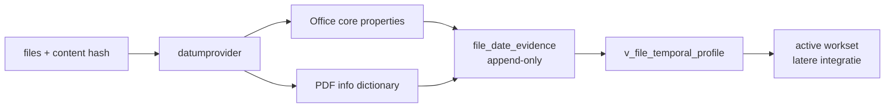

# SCRUM-69 — Generieke datum-evidence en provenance

## Doel

CORE bewaart documentdatums als afzonderlijke bronwaarnemingen. Een datum uit Office,
PDF, toekomstig mediaformaat of filesystem wordt niet stilzwijgend de waarheid en krijgt
geen formaat-specifieke kolom in `metadata`. Providerfase v1 ondersteunt DOCX, XLSX en PDF.

## Datamodel

`file_date_evidence` is append-only en bevat:

- `file_id`, optionele `content_group_id` en de bijbehorende `content_sha256`;
- `evidence_scope`: embedded metadata hoort bij content; latere filesystemevidence bij een file;
- uniforme `date_type`, zoals `created` of `modified`;
- `source_type`, oorspronkelijk `source_field` en ruwe waarde;
- UTC-waarde wanneer de bron een tijdzone bevat;
- lokale klokwaarde en expliciete tijdzonestatus;
- confidence, extractorversie, details en een stabiele `idempotency_key`.

`metadata.created_at` blijft uitsluitend het aanmaakmoment van het CORE-metadatarecord.



## Providers v1

| Formaat | Bron | Velden | Confidence |
|---|---|---|---|
| DOCX/XLSX | OOXML core properties | `dcterms:created`, `dcterms:modified` | medium met tijdzone; low zonder tijdzone |
| PDF | Information Dictionary en XMP | `/CreationDate`, `/ModDate`, `xmp:CreateDate`, `xmp:ModifyDate` | medium met tijdzone; low zonder tijdzone |

Een PDF-aanmaakdatum beschrijft vaak de PDF-export, niet noodzakelijk het oorspronkelijke
document. Daarom blijft provenance zichtbaar.

## Temporal profile

`v_file_temporal_profile` geeft per actief bestand de beste huidige created/modified-
interpretatie. De view gebruikt alleen evidence voor de huidige `content_sha256`, toont
evidence-ID, bron en confidence en markeert conflicten. Onderliggende evidence wordt nooit
overschreven.

Exacte fysieke kopieën delen embedded evidence via hun `content_sha256`. Office/PDF-datums
worden daardoor niet per duplicate opgeslagen. Het waargenomen `file_id` blijft provenance,
maar is niet de identiteit van content-scope evidence.

Foreign keys verwijderen evidence niet via cascade. CORE gebruikt soft-delete; fysieke
verwijdering van een database-identiteit vereist daardoor eerst een expliciet retentiebesluit
voor het bijbehorende bewijs.

## Runtime-integratie

Na een file-upsert extraheert Metadata Worker datum-evidence binnen dezelfde transactie.
Een ontbrekend oud schema wordt veilig overgeslagen. Een corrupte, onleesbare of beveiligde
bron geeft een waarschuwing en stuurt het verder geldige file-event niet naar de DLQ.

## Uitrol naar ACC

Voer na merge en pull eerst de migratie uit en bouw daarna Metadata Worker opnieuw:

```bash
docker exec -i postgres psql -v ON_ERROR_STOP=1 -U hugo -d nasdb_test \
  < database/migrations/20260810_add_file_date_evidence.sql

docker compose build metadata_worker
docker compose up -d --force-recreate metadata_worker
```

Inventariseer bestaande documenten zonder writes:

```bash
core metadata date-backfill \
  --source /volume1/data/import/cloud/onedrive/current/Documenten \
  --dry-run
```

Pas de idempotente backfill daarna expliciet toe:

```bash
core metadata date-backfill \
  --source /volume1/data/import/cloud/onedrive/current/Documenten \
  --apply
```

Herhalen is veilig: dezelfde observatie maakt geen tweede record. Bronbestanden veranderen niet.

## Verificatie

```sql
SELECT source_type, date_type, confidence, COUNT(*)
FROM file_date_evidence
GROUP BY source_type, date_type, confidence
ORDER BY source_type, date_type, confidence;

SELECT * FROM v_file_temporal_profile
WHERE evidence_count > 0
ORDER BY file_id DESC
LIMIT 25;
```

## Rollback

```bash
docker exec -i postgres psql -v ON_ERROR_STOP=1 -U hugo -d nasdb_test \
  < database/migrations/rollback/20260810_add_file_date_evidence.sql
```

Rollback verwijdert alleen de afgeleide evidence en view. Zet eerst de vorige Metadata
Worker-versie terug. Bronbestanden en `files`/`metadata` blijven intact.

## Vervolg

Media krijgt later providers voor EXIF en containerdatums zonder wijziging van het model.
De active-worksetengine consumeert de temporal-profileview in een afzonderlijke refinement.
