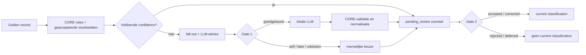

# SCRUM-85 Persoonlijke LLM-classificatie

## Doel

Deze pilot gebruikt een lokale LLM om controleerbare organisatievoorstellen te
maken voor persoonlijke OneDrive golden records. Het resultaat is advies voor
categorie, documentfamilie, lifecycle en doelpad. De pilot verplaatst, hernoemt,
archiveert of verwijdert niets.

## Grenzen

- Bron: standaard `/volume1/data/import/cloud/onedrive/current/Documenten`.
- Selectie: maximaal 25 recente persisted golden records met volledige SHA-256.
- Formaten: PDF en DOCX met lokaal extraheerbare tekst.
- Exacte contentgroep: maximaal één golden record.
- Verwerking: uitsluitend lokaal via de provider-onafhankelijke LLM-interface.
- Databasewrites en bestandsmutaties: uitgeschakeld.
- Elk voorstel heeft `needs_review=true`.

De eerdere embeddingpilot is geen toelatingseis. Een recent golden record zonder
semantic metadata kan lokaal worden geëxtraheerd en geclassificeerd. Padnamen
worden alleen gebruikt voor spreiding van de pilotselectie en als zwakke hint;
ze gelden nooit als classificatiewaarheid.

## Selectie controleren

Maak eerst uitsluitend het manifest en de compacte selectie-CSV:

```sh
core semantic personal-classification \
  --cutoff 2024-08-09T00:00:00+02:00 \
  --limit 25 \
  --dry-run
```

De round-robinselectie spreidt waar beschikbaar over administratie, financiën,
wonen, werk, studie, projecten en algemeen persoonlijk, en over PDF/DOCX en
groottes. Financiële, werk- en andere persoonlijke documenten mogen deelnemen,
omdat inhoud lokaal blijft. Duidelijke secretbestanden worden uitgesloten.

Ieder geselecteerd manifestitem start met:

```json
"approval": "pending_review"
```

Controleer de paden en wijzig elk item expliciet naar `approved` of `excluded`.
De classifier weigert een manifest zolang ook maar één `pending_review` resteert.
Minstens één document moet zijn goedgekeurd.

## Lokale classificatie uitvoeren

Na controle van het manifest:

```sh
core semantic personal-classification \
  --manifest project/exports/semantic-pilot/personal-golden-classification-manifest-YYYYMMDD-HHMMSS.json \
  --max-chunks 3 \
  --model qwen3.6:latest \
  --endpoint http://192.168.68.107:11434/v1 \
  --timeout-seconds 600
```

CORE extraheert per document maximaal drie gelijkmatig verdeelde chunks in de
bestaande offline semantic-container. De tekst wordt alleen in geheugen aan de
lokale LLM aangeboden en komt niet in rapport, CSV of database. Na ieder document
wordt een tijdelijk checkpoint geschreven, zodat bij een onderbreking reeds
verkregen voorstellen niet verloren gaan. Hervat met dezelfde selectieparameters
en `--resume project/exports/semantic-pilot/personal-golden-classification-checkpoint-....json`.

Vlak voor extractie vergelijkt CORE ieder goedgekeurd item opnieuw met de
operationele database. De volledige SHA-256, contentgroep, golden file-ID en het
bronpad moeten nog exact overeenkomen. Bij afwijking wordt de hele run geweigerd;
CORE vervangt of actualiseert nooit stil een beoordeeld document.

## Classificatiecontract

Prompt `scrum-85-personal-classification-v2` levert uitsluitend inhoudelijke
voorstellen:

- `document_type`;
- `category`: `personal`, `administration`, `finance`, `home`, `work`, `study`,
  `projects` of `other`;
- `document_family` en maximaal vijf onderwerpen;
- `lifecycle`: `active_candidate`, `archive_candidate`, `needs_review` of
  `quarantine`;
- `sensitivity` en expliciete `sensitivity_signals`;
- `confidence` en `reason`.

De LLM levert geen doelpad. CORE normaliseert categorie en documentfamilie,
verhoogt sensitivity wanneer beleidsregels dat vereisen, begrenst confidence bij
correcties en bouwt deterministisch:

```text
{Active|Archive|Review|Quarantine}/{Category}/{canonical_family}/{original_filename}
```

Voorbeelden van canonieke families zijn `curriculum_vitae`, `invoices`,
`income_tax`, `interview_preparation`, `vacancy_publications`, `diplomas`,
`certificates`, `vve_regulations` en `vve_technical_memos`. Hierdoor krijgen
inhoudelijk equivalente PDF- en DOCX-uitgaven dezelfde familie, onafhankelijk van
hoofdletters, taalvariant of vrije formulering van het model.

Mutatiedatum mag lifecycle ondersteunen maar bepaalt nooit documenttype of
categorie. Financiële, identiteits-, overheids-ID- en gezondheidsindicatoren
leggen een minimale sensitivity op. Bij categorie-, familie- of
sensitivitycorrecties wordt `high` confidence maximaal `medium`. Een onbekende
enum, ontbrekend sensitivitysignaal of ongeldige JSON wordt teruggebracht naar
`Review/Unclassified` met lage confidence.

Rapportage bewaart zowel `model_*`-waarden als de canonieke waarden en vermeldt
iedere correctie in `normalization_warnings`. Dit maakt het beleid controleerbaar
zonder het vrije modelvoorstel als operationele waarheid te behandelen.

## Vervolg

De JSON-, Markdown- en compacte CSV-uitvoer zijn reviewmateriaal. Pas na
menselijke beoordeling en een afzonderlijk go/no-go kan een copy/move-plan worden
ontworpen. Cleanup, archivering en retentie blijven aparte geautoriseerde stappen.

## ACC-opslag van voorstellen en reviews

De acceptatieomgeving kan classificaties versieerbaar opslaan zonder documenten
te muteren of geëxtraheerde tekst te bewaren. De opslag gebruikt drie gescheiden
entiteiten:

- `classification_runs`: manifest-, prompt-, contract-, provider- en
  modelprovenance van een afgeronde lokale run;
- `classification_proposals`: canonieke machinevoorstellen met de bijbehorende
  contenthash en status `pending_review`;
- `classification_reviews`: append-only menselijke besluiten. Een review wordt
  nooit overschreven; een correctie is een nieuw besluit met een nieuwe
  `idempotency_key`.

`ai_output` wordt hiervoor niet hergebruikt. Die legacy-tabel mist het
classificatiecontract, reviewhistorie en voldoende lineage. Semantic extractie,
embeddings en classificatie blijven zo afzonderlijke processtappen.

Pas eerst de migratie toe op `nasdb_test`:

```sh
docker exec -i postgres psql -v ON_ERROR_STOP=1 -U hugo -d nasdb_test \
  < database/migrations/20260809_add_classification_acc_storage.sql
```

Maak daarna eerst een opslagplan van een afgerond v2-classificatierapport:

```sh
core semantic classification-acc proposals \
  project/exports/semantic-pilot/personal-golden-classification-YYYYMMDD-HHMMSS.json \
  --dry-run
```

Controleer het JSON-plan. Met exact dezelfde invoer ontstaat dezelfde run-ID,
proposal-ID en proposalhash. Opslaan in ACC gebeurt pas expliciet:

```sh
core semantic classification-acc proposals \
  project/exports/semantic-pilot/personal-golden-classification-YYYYMMDD-HHMMSS.json \
  --apply
```

De transactie weigert een voorstel wanneer file-ID, volledige SHA-256,
contentgroep en huidig golden record niet meer overeenkomen. Opnieuw uitvoeren
is idempotent. Een gelijk gebleven deterministische ID met een afwijkende
proposalhash wordt als provenancefout geweigerd.

Een geaccepteerde menselijke review gebruikt bijvoorbeeld:

```json
{
  "proposal_id": "00000000-0000-0000-0000-000000000000",
  "idempotency_key": "hugo-review-3361755-v1",
  "decision": "accepted",
  "reviewer": "hugo",
  "reviewed_at": "2026-08-09T13:00:00+02:00",
  "category": "administration",
  "document_family": "government_correspondence",
  "lifecycle": "active_candidate",
  "suggested_path": "Active/Administration/government_correspondence/brief.pdf",
  "sensitivity": "personal",
  "confidence": "medium",
  "notes": "Inhoud en doelpad beoordeeld"
}
```

Ook reviews doorlopen eerst `--dry-run` en daarna optioneel `--apply`:

```sh
core semantic classification-acc review review.json --dry-run
core semantic classification-acc review review.json --apply
```

`v_current_file_classification` toont maximaal één nieuwste geaccepteerd besluit
per bestand, en alleen zolang het bestand actief, nog het golden record en qua
contenthash ongewijzigd is. Pending en afgewezen voorstellen worden nooit als
huidige classificatie gepubliceerd. Controleer bijvoorbeeld:

```sql
SELECT file_id, category, document_family, lifecycle, suggested_path,
       sensitivity, confidence, reviewer, reviewed_at
FROM v_current_file_classification
ORDER BY reviewed_at DESC;
```

Rollback is alleen bedoeld voor ACC en verwijdert de view en alle drie de nieuwe
tabellen inclusief reviewhistorie:

```sh
docker exec -i postgres psql -v ON_ERROR_STOP=1 -U hugo -d nasdb_test \
  < database/migrations/rollback/20260809_add_classification_acc_storage.sql
```

## Taal- en padbeleid

CORE scheidt technische identiteit van gebruikerspresentatie:

- interne enums en canonieke sleutels blijven stabiel Engels, bijvoorbeeld
  `finance`, `active_candidate` en `income_tax_return`;
- zichtbare labels worden Nederlands, bijvoorbeeld `Financiën`, `Actief` en
  `Aangifte inkomstenbelasting`;
- fysieke doelpaden worden eveneens Nederlands;
- de omzetting wordt configuration-driven en krijgt een expliciete
  padbeleidversie, bijvoorbeeld `personal-path-policy-nl-v1`;
- het oorspronkelijke technische voorstel blijft als lineage beschikbaar.

Een toekomstig beoordeeld doelpad kan daardoor bijvoorbeeld zijn:

```text
Actief/Financiën/Aangifte inkomstenbelasting/Aangifte_2025.pdf
Archief/Werk/Curriculum vitae/CV.pdf
Beoordelen/Wonen/VvE technische memo/MEMO_riolering.pdf
```

De huidige Engelse `suggested_path`-waarden zijn model-/beleidsvoorstellen en
blijven `pending_review`. Ze worden niet geaccepteerd en nooit gebruikt voor
bestandsmutaties voordat het Nederlandstalige padbeleid is toegepast.

## Stand van de pilot op 9 augustus 2026

- Het eerste gevalideerde ACC-opslagplan bevat zes goedgekeurde documenten,
  zes voorstellen en nul technische fouten.
- Alle voorstellen blijven `pending_review`; de current-view bevat hierdoor nog
  geen definitieve classificaties.
- Negentien bestanden uit het oorspronkelijke manifest waren expliciet
  uitgesloten en zijn niet geclassificeerd of opgeslagen.
- De volgende stap is het configuration-driven Nederlandse padbeleid, gevolgd
  door een compacte menselijke reviewflow.
- Dagelijkse kleine batches en een copy/move-plan volgen pas na beoordeling van
  deze pilot. Cleanup en bestandsmutaties blijven afzonderlijke, expliciet
  geautoriseerde processen.

## CORE-first classificatie

CORE is verantwoordelijk voor classificatie, routing en confidence. De lokale
LLM is geen standaardverwerker, maar een optionele fallback of een handmatig
aangevraagde adviseur.

De standaardroute gebruikt:

1. versieerbare business rules en technische metadata;
2. documenteigenschappen en extractiesignalen;
3. uitsluitend menselijk geaccepteerde classificaties als voorbeelden;
4. embeddingvergelijking met die geaccepteerde voorbeelden;
5. een door CORE berekende confidence en conflictcontrole.

Machinevoorstellen mogen zichzelf niet als nieuw voorbeeld bevestigen. Een
nieuwe voorbeeldset wordt versieerbaar en in batches geëvalueerd voordat deze
actief wordt.

### Classification fall-out

Bij onvoldoende confidence, conflicterende signalen of een onbekende
documentfamilie maakt CORE geen geforceerde classificatie. Het maakt een
uitlegbaar fall-outrecord met minimaal:

- gebruikte regels en rulesetversie;
- dichtstbijzijnde geaccepteerde voorbeelden en scoremarge;
- CORE-confidence en conflicten;
- reden waarom lokale LLM-analyse wel of niet wordt geadviseerd;
- voorgesteld model, promptversie, maximale chunks en sensitivitywaarschuwing.

De mens kiest vervolgens `manual_classification`, `approve_local_llm`, `defer`
of `exclude`.

### Twee menselijke gates

**Gate 1 — toestemming voor LLM-gebruik**

Gate 1 staat CORE toe om voor één zichtbaar document of een vooraf afgebakende
batch maximaal het goedgekeurde aantal passages aan het geconfigureerde lokale
model aan te bieden. Zonder deze approval wordt geen LLM aangeroepen.

**Gate 2 — beoordeling van het resultaat**

Na de LLM-run valideert en normaliseert CORE de output. Het resultaat blijft
`pending_review`. De mens accepteert, corrigeert, wijst af of stelt uit. Gate 1
is nadrukkelijk nooit een automatische Gate-2-acceptatie.



## Gefaseerd implementatieplan

### Fase 0 — database- en contractgrens

- Meet tabel-, index- en groeivolumes via SCRUM-78.
- Hergebruik `files`, `content_groups`, proposals en append-only reviews.
- Voeg geen nieuwe brede waarheidstabel toe wanneer een view volstaat.
- Ontwerp classificatiecontract v3 met afzonderlijk `domain`, `document_role`,
  `document_family`, routing en CORE-confidence.

### Fase 1 — Nederlands actief padbeleid

- Implementeer `personal-path-policy-nl-v1` configuration-driven.
- Houd technische codes Engels en fysieke labels Nederlands.
- Gebruik inhoudelijke domeinen: Persoonlijk, Werk en loopbaan, Financiën,
  Wonen, Leren en ontwikkeling en Projecten.
- Gebruik `administration` nooit als fysieke hoofdmap; normaliseer naar een
  inhoudsdomein of `Beoordelen`.

### Fase 2 — rules-only MVP

- Selecteer uitsluitend ondersteunde persoonlijke documenten en golden records.
- Bouw een kleine, versieerbare ruleset voor bekende families uit de pilot.
- Produceer rules-only voorstellen en fall-out zonder LLM-call.
- Leg routing, evidence, conflict en CORE-confidence vast.

### Fase 3 — beoordeelde voorbeelden

- Gebruik alleen Gate-2-geaccepteerde classificaties als voorbeelden.
- Zoek semantisch vergelijkbare voorbeelden met de bestaande lokale embeddings.
- Combineer rule- en voorbeeldsignalen; meet scoremarge en disagreement.
- Laat onzekere gevallen in fall-out staan.

### Fase 4 — approval-gated LLM-fallback

- Presenteer fall-out mobiel met advies en privacy-/resourcescope.
- Implementeer append-only Gate-1-approval per document en kleine batch.
- Start de lokale LLM uitsluitend na geldige approval.
- Sla het genormaliseerde resultaat opnieuw als `pending_review` op.

### Fase 5 — compacte menselijke review

- Bouw Gate 2 als mobiele quiz met preview, domein, rol, familie, lifecycle en
  Nederlands doelpad.
- Ondersteun accepteren, corrigeren, afwijzen, uitstellen en notities.
- Publiceer alleen geaccepteerde current classifications.

### Fase 6 — actieve-werksetpilot

- Selecteer 20–50 actuele of blijvend belangrijke geaccepteerde documenten.
- Genereer eerst een idempotent, read-only copy-plan.
- Kopieer pas na afzonderlijke apply-goedkeuring naar de Nederlandse `Actief/`
  structuur.
- Verifieer contenthash, aantallen, collisions en provenance.
- Verwijder of wijzig geen OneDrive- of historische bronbestanden.

### Fase 7 — dagelijkse achtergrondbatch

- Zet dagelijks een kleine batch nieuwe, gewijzigde of ongeclassificeerde golden
  records klaar.
- Laat CORE bekende gevallen zelf voorstellen.
- Vraag alleen voor fall-out menselijke actie of LLM-toestemming.
- Houd archief, retention en cleanup buiten het actieve-werkset-MVP; deze volgen
  later als afzonderlijke gecontroleerde processen.

## MVP-go/no-go

De actieve-werksetpilot mag pas kopiëren wanneer:

- de databasegroei en indeximpact bekend en acceptabel zijn;
- het Nederlandse padbeleid is goedgekeurd;
- iedere kandidaat een current, menselijk geaccepteerde classificatie heeft;
- Gate-1- en Gate-2-besluiten afzonderlijk auditbaar zijn;
- dry-run, idempotency, hashverificatie en collisioncontrole slagen;
- rollback betekent dat uitsluitend de nieuw gemaakte doelkopieën veilig kunnen
  worden verwijderd, zonder de bronnen te raken.
