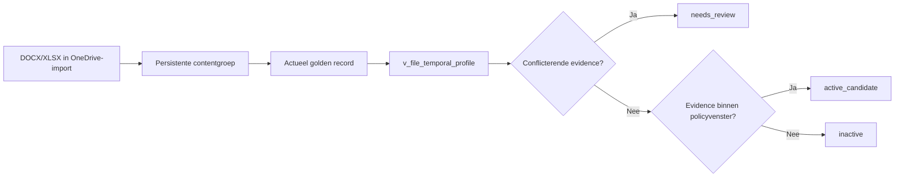

# SCRUM-89 Active workset pilot

## Doel

De eerste actieve-werksetpilot selecteert read-only actuele documentkandidaten
uit de tijdelijke OneDrive-basis. De pilot verplaatst geen bestanden, schrijft
niet naar PostgreSQL en gebruikt geen LLM.

## Afbakening

- Bron: `/volume1/data/import/cloud/onedrive/current/Documenten`.
- Bestandstypen: `docx` en `xlsx`.
- Activiteitsvenster: configuration-driven, initieel negen kalendermaanden.
- Exacte duplicaten: maximaal één resultaat per persistente contentgroep.
- Kandidaat: uitsluitend het actuele, niet-verwijderde `content_groups.golden_file_id`.
- Tijdsbewijs: filesystem-mtime plus `v_file_temporal_profile` van het golden record.

De policy staat in `project/policies/active-workset-v1.json`. De termijn staat
daarmee niet hardcoded in selectiecode of reason-codes.

## Selectieflow



Bron-created en bron-modified evidence zijn contentgebonden en kunnen daardoor
op het actuele golden record worden geprojecteerd. Niet-golden duplicaten krijgen
geen eigen werksetstatus. Een golden-recordwissel verandert de evidencehistorie
niet; een volgende pilotrun beoordeelt het dan actuele golden record.

## Uitvoeren

```sh
core workset pilot --dry-run
```

Reproduceerbaar uitvoeren:

```sh
core workset pilot --as-of 2026-08-10T12:00:00+02:00 --dry-run
```

## Uitvoer

Onder `project/exports/active-workset/` verschijnen een volledige CSV, compacte
review-CSV, JSON, Markdown en de verwijzingen `active-workset-v1-latest.json` en
`active-workset-v1-latest.md`.

De reviewselectie is configuration-driven. Zij bevat steekproeven van actieve
kandidaten, kandidaten net buiten het venster, duplicaatgroepen en temporal
conflicts. Eén golden record komt hoogstens eenmaal voor; meerdere reviewredenen
worden gecombineerd.

## Tijdcontract en beslisregels

`files.created_at` wordt uitsluitend geëxporteerd als `core_first_observed_at`.
Dit is geen documentaanmaakdatum en telt niet mee als activiteit.

CORE kiest het nieuwste geldige signaal uit bron-modified, bron-created en
filesystem-mtime. De confidence volgt het gekozen signaal; filesystem-mtime is
`low`. Een temporal conflict heeft voorrang op een recente datum en vereist
menselijke beoordeling.

| Status | Reden | Betekenis |
|---|---|---|
| `active_candidate` | `source_metadata_modified_within_configured_window` | Embedded bron-modified valt binnen negen maanden |
| `active_candidate` | `source_metadata_created_within_configured_window` | Embedded bron-created valt binnen negen maanden |
| `active_candidate` | `filesystem_mtime_within_configured_window` | Filesystem-mtime valt binnen negen maanden |
| `inactive` | `no_qualifying_activity_within_configured_window` | Geen bruikbaar signaal binnen het policyvenster |
| `needs_review` | `conflicting_temporal_evidence` | Meerdere bronwaarden spreken elkaar tegen |
| `needs_review` | `missing_persisted_golden_record` | Er is geen actueel persisted golden record |
| `needs_review` | `invalid_or_missing_activity_timestamp` | Tijdsbewijs ontbreekt of ligt in de toekomst |

`content_changed_at` en `last_human_activity_at` blijven expliciete ontbrekende
evidence zolang hash-events en Windows/SMB-activiteit nog niet in dit contract
zijn geïntegreerd.

## Geen menselijke activiteit afleiden uit raw atime

Synology's **Laatst geopend** kan door een menselijke SMB-read veranderen, maar ook
door CORE zelf. Hashing, datum- en metadata-extractie, semantic extraction en embeddings
lezen het document. Een reeks vrijwel opeenvolgende access-tijden kan daarom een technische
batch zijn en mag niet als menselijk gebruik in de negenmaandenpolicy terechtkomen.

De active-worksetpilot gebruikt raw filesystem `atime` daarom niet. De toekomstige
activity-keten scheidt minimaal:

| Waarneming | Actor | Gebruik in actieve werkset |
|---|---|---|
| Bekende hash-, extractie- of embedding-read | `system` | Uitsluiten |
| Cloud Sync/import | `system` | Uitsluiten als human activity |
| Onverklaarde atime-verandering | `unknown` | Hoogstens lage confidence/review |
| Bevestigd SMB- of applicatie-event | `owner`/`application` | Bruikbaar met provenance |

Technische reads worden later append-only vastgelegd en gecorreleerd; `atime` wordt niet
teruggezet. Een filesystem-birthtime die na `mtime` ligt geldt als NAS-/syncmoment en niet
als oorspronkelijke documentaanmaakdatum.

## Veiligheidsgrenzen

- Geen databasewrites of bestandsmutaties.
- Geen lifecycle- of doelpadwijzigingen.
- Geen classificatie of LLM-verwerking.
- Geen raw filesystem-atime als menselijke activiteit.
- Alleen huidige golden records worden automatisch active/inactive beoordeeld.
- Ontbrekende golden records en temporal conflicts worden niet automatisch beslist.
- Policywaarde en policyversie worden bij ieder resultaat vastgelegd.

## Database-backed actuele view

Na de exportpilot biedt `v_active_document_workset` hetzelfde beslisdomein als
read-only databaseprojectie voor het portaal en Pulse. De view leest uitsluitend
de effectieve `active_document_workset`-policy uit `v_current_policies` en gebruikt
daaruit het activiteitsvenster, de toegestane extensies en bronroots.

De omgeving wordt voorlopig gelezen uit de PostgreSQL-setting `core.environment`.
Wanneer die ontbreekt, gebruikt de huidige acceptatieomgeving expliciet
`acceptance`. Deze tijdelijke discriminator wordt bij de fysieke O/A/P-scheiding
opnieuw beoordeeld onder SCRUM-78.

```sql
SELECT
    file_id,
    filename,
    workset_status,
    last_qualifying_activity_at,
    reason_code,
    activity_confidence,
    policy_version
FROM v_active_document_workset
ORDER BY last_qualifying_activity_at DESC NULLS LAST;
```

Voor alleen de voorgestelde actieve werkset:

```sql
SELECT *
FROM v_active_document_workset
WHERE workset_status = 'active';
```

De view bevat ook `inactive` en `needs_review`, zodat een beslissing verklaarbaar
blijft. Alleen materieel conflicterende temporal evidence, ontbrekende activiteit
en datums in de toekomst worden nooit automatisch actief. Technisch equivalente
PDF Info/XMP-representaties worden verklaard door `temporal-resolution-v1`; de
bron-evidence blijft ongewijzigd en auditbaar. De view gebruikt alleen het actuele,
niet-verwijderde golden record en schrijft niets naar bestanden of tabellen.

Iedere rij bevat policy-ID, versie, contractschema, checksum en ingangsdatum. Zo
kan achteraf worden gereconstrueerd onder welke policy de status is berekend.
