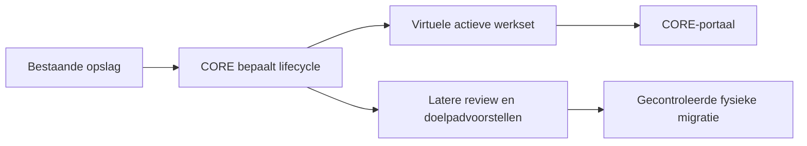
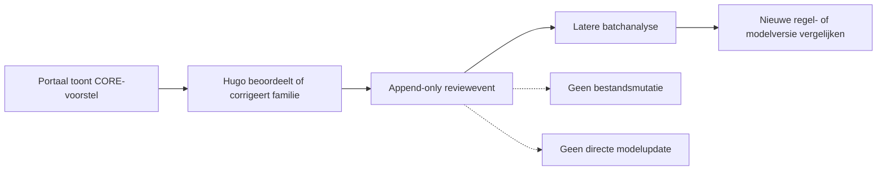

# SCRUM-95 — Virtuele actieve werkset in het CORE-portaal

## Doel

De eerste persoonlijke CORE-werkruimte toont actieve documenten direct vanuit
de database, terwijl de bestanden nog veilig op hun bestaande locatie blijven.
Dit ondersteunt de gekozen geleidelijke migratie: eerst overzicht en controle,
daarna pas goedgekeurde fysieke organisatie.



## MVP

Na deployment is de werkset beschikbaar op:

```text
http://192.168.68.105:8080/coreworkset
```

De pagina biedt:

- standaard alleen actieve golden records;
- totalen voor actief, inactief en beoordelen;
- zoeken op bestandsnaam of huidig pad;
- filters voor lifecycle en PDF, DOCX of XLSX;
- filter op de door CORE voorgestelde documentfamilie;
- activiteitstijdstip, reason-code en confidence;
- huidige fysieke locatie en kopieerbaar Windows SMB-pad;
- geaccepteerde classificatie wanneer die beschikbaar is;
- een eerlijke melding wanneer classificatie nog ontbreekt;
- paginering en een mobiele weergave voor iPhone.

De API is `GET /api/v1/workset`. Filters zijn begrensd en worden uitsluitend als
parameters aan SQL doorgegeven. Zonder reviewfeatureflag meldt de response
`database_writes: false`; bestandsmutaties en directe modelupdates zijn altijd
`false`.

## Veiligheidsgrens

Het portaal verplaatst, kopieert, archiveert of verwijdert niets. Het getoonde
SMB-pad is alleen een verwijzing naar de bestaande locatie. Een toekomstige
migratie-engine krijgt een apart plan-, review-, apply- en rollbackcontract.

## Interactieve beoordeling in acceptatie

Het portaal toont doelpadvoorstellen uit SCRUM-96. Per actief golden record zijn
vier auditbare antwoorden beschikbaar: `Akkoord`, `Later`, `Niet akkoord` en
`Overslaan`. De voorgestelde familie kan vóór opslag worden gecorrigeerd en een
korte notitie is optioneel.

Beoordelingen worden append-only opgeslagen in `document_review_events`.
`v_latest_document_review` toont het laatste oordeel, terwijl eerdere oordelen
behouden blijven en via `supersedes_event_id` zijn verbonden. Iedere opslag
bevat documentidentiteit, golden-recordgroep, contenthash, het getoonde
voorstel, confidence, reason-code, contractversie, reviewer en timestamp.
Retries zijn veilig door een unieke idempotency key.

Een geaccepteerde familiecorrectie krijgt in de portaalprojectie voorrang op
het oorspronkelijke CORE-familievoorstel. Daardoor wijzigen het zichtbare
familielabel, het familiefilter en het opnieuw berekende virtuele doelpad direct
naar de menselijke keuze. Het oorspronkelijke voorstel blijft ongewijzigd in
de revieweventhistorie aanwezig. Deze projectie verplaatst nog steeds niets.

Na het opslaan blijft de pagina op dezelfde scrollpositie met dezelfde filters
staan. Alleen de beoordeelde kaart wordt gericht bijgewerkt met het nieuwe
oordeel en eventueel herberekende virtuele doelpad. In het standaardfilter
`Nog te beoordelen` verdwijnt deze kaart daarna uit de wachtrij. Het document
blijft beschikbaar via `Beoordeeld` en `Alle oordelen`. Hiermee blijft een
reeks beoordelingen rustig uitvoerbaar zonder telkens de volledige werkset te
laden of beoordeelde kaarten opnieuw tegen te komen.

De beoordeelde weergave heeft aanvullende filters voor `Akkoord`, `Later`,
`Niet akkoord` en `Overgeslagen`, met compacte tellers. `Historie` opent per
document alle append-only reviewevents inclusief reviewer, datum, familie en
notitie. CSV- en JSON-export leveren dezelfde handmatige beslissingen voor
controle of latere batchanalyse. Labels onderscheiden expliciet het
`CORE-voorstel` van het `Menselijk oordeel`; een toekomstig AI-advies krijgt
een eigen provenance-label en wordt niet met één van beide vermengd.



Deze opslaggrens is voorbereid voor de toekomstige documentquiz uit
[SCRUM-94](https://hugohoogendoorn.atlassian.net/browse/SCRUM-94). De quiz zelf
blijft op backlog; SurveyJS, dagelijkse vragen en gamification vallen buiten
deze portaluitbreiding.

## Deployment

Na merge en pull:

```bash
docker exec -i postgres psql -v ON_ERROR_STOP=1 -U hugo -d nasdb_test \
  < database/migrations/20260811_add_document_review_events.sql
```

Zet voor ACC in `.env`:

```dotenv
CORE_REVIEW_WRITES_ENABLED=true
CORE_REVIEWER=hugo
```

Herbouw daarna het dashboard:

```bash
docker compose up -d --build dashboard
```

Zonder de featureflag blijft de portal backward-compatible read-only. De
container en gedeelde volume-mount blijven read-only; alleen de begrensde
PostgreSQL-INSERT voor menselijke reviewevents wordt geactiveerd.

De bestaande Pulse-pagina blijft beschikbaar en bevat een shortcut naar de
werkset. Een MkDocs-rebuild is alleen nodig wanneer de bijgewerkte documentatie
direct in de permanente Wiki moet verschijnen.
