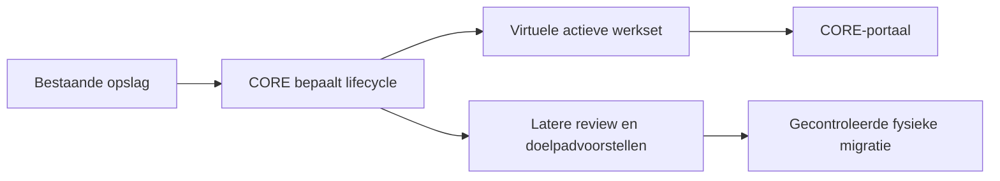

# SCRUM-95 — Virtuele actieve werkset in het CORE-portaal

## Doel

De eerste persoonlijke CORE-werkruimte toont actieve documenten direct vanuit
de database, terwijl de bestanden nog veilig op hun bestaande locatie blijven.
Dit ondersteunt de gekozen geleidelijke migratie: eerst overzicht en controle,
daarna pas goedgekeurde fysieke organisatie.



## MVP

Na deployment is de werkset beschikbaar op:

```text
http://192.168.68.105:8080/coreworkset
```

De pagina biedt:

- standaard alleen actieve golden records;
- totalen voor actief, inactief en beoordelen;
- zoeken op bestandsnaam of huidig pad;
- filters voor lifecycle en PDF, DOCX of XLSX;
- activiteitstijdstip, reason-code en confidence;
- huidige fysieke locatie en kopieerbaar Windows SMB-pad;
- geaccepteerde classificatie wanneer die beschikbaar is;
- een eerlijke melding wanneer classificatie nog ontbreekt;
- paginering en een mobiele weergave voor iPhone.

De API is `GET /api/v1/workset`. Filters zijn begrensd en worden uitsluitend als
parameters aan read-only SQL doorgegeven. De response meldt expliciet
`database_writes: false` en `file_mutations: false`.

## Veiligheidsgrens

Deze versie heeft geen actie-endpoints. Het portaal verplaatst, kopieert,
archiveert of verwijdert niets en slaat geen beoordelingen op. Het getoonde
SMB-pad is alleen een verwijzing naar de bestaande locatie. Een toekomstige
migratie-engine krijgt een apart plan-, review-, apply- en rollbackcontract.

## Deployment

Na merge en pull:

```bash
core dashboard deploy
```

De bestaande Pulse-pagina blijft beschikbaar en bevat een shortcut naar de
werkset. Een MkDocs-rebuild is alleen nodig wanneer de bijgewerkte documentatie
direct in de permanente Wiki moet verschijnen.
