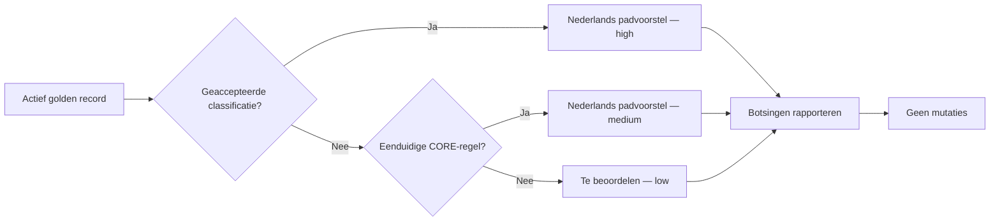

# SCRUM-96 — Canoniek Nederlands doelpadcontract

SCRUM-96 vertaalt de actieve persoonlijke werkset naar **voorstellen** voor een
eenvoudige Nederlandse mappenstructuur. De pilot verplaatst, kopieert, hernoemt
of verwijdert geen bestanden en schrijft niets naar de database.

## Contractgrenzen

- technische codes blijven Engels en stabiel;
- schermlabels en fysieke doelpaden zijn Nederlands;
- `Administratie` is geen hoofdcategorie;
- lifecyclezones en inhoudelijke categorieën zijn afzonderlijk;
- alleen `active` records uit `v_active_document_workset` worden getoetst;
- dat zijn actuele golden records volgens de databaseview;
- alleen een geaccepteerde menselijke classificatie krijgt `high` confidence;
- eenvoudige, verklaarbare trefwoordregels krijgen `medium` confidence;
- onvoldoende bewijs gaat naar `Te beoordelen` met `low` confidence;
- een botsend doelpad wordt gerapporteerd en niet automatisch opgelost.

## Structuur v1

```text
Persoonlijk/
├── Actief/
│   ├── Werk & Loopbaan/
│   ├── Wonen/
│   ├── Geldzaken/
│   ├── Gezondheid/
│   ├── Gezin & Relaties/
│   ├── Leren & Ontwikkelen/
│   ├── Persoonlijk & Identiteit/
│   └── Juridisch/
├── Archief/
├── Te beoordelen/
└── Quarantaine/
```

De pilot gebruikt alleen `Actief` en `Te beoordelen`. Archief- en
quarantainebesluiten horen bij latere, afzonderlijk goedgekeurde processen.

## Beslisflow



## Uitvoeren in acceptatie

```bash
core workset target-path-pilot --limit 50 --dry-run
```

De uitvoer verschijnt onder `project/exports/active-workset/` als CSV, JSON en
Markdown. `canonical-target-path-latest.md` geeft het snelste overzicht. De
CSV is bedoeld voor review; het JSON-bestand bevat contractversie, checksum,
reason-codes en safetyflags voor reproduceerbaarheid en audit.

Deze toets bewijst alleen of het contract bruikbare voorstellen oplevert. Een
latere migratie- of portalflow moet elk fysiek bestand nog afzonderlijk laten
goedkeuren en rollbackbaar uitvoeren.
