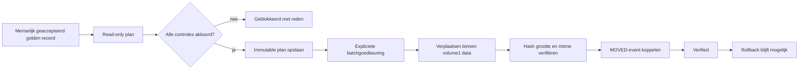

# SCRUM-97 — gecontroleerde migratie van persoonlijke documenten

CORE kan goedgekeurde persoonlijke documenten gecontroleerd verplaatsen naar
`/volume1/data/Persoonlijk/Actief` of `/volume1/data/Persoonlijk/Inactief`.
De executor gebruikt uitsluitend actuele golden records waarvoor lifecycle én
doelpad door een mens zijn geaccepteerd. Classificaties worden niet aangepast en
bestanden worden nooit overschreven of verwijderd.

Een plan bewaart `/volume1/data` als canonieke bronroot. De database accepteert
deze exacte root en, voor toekomstige beperkte runs, een onderliggende map. Het
doel blijft strikt `/volume1/data/Persoonlijk`; itemdoelen moeten daaronder in
`Actief` of `Inactief` vallen. Hierdoor komt het plancontract overeen met de
padvalidatie van de executor zonder het toegestane doelgebied te verruimen.

## Veiligheidsflow



## Installatie

Voer eerst de schemawijziging uit in de acceptatiedatabase:

```bash
docker exec -i postgres psql -v ON_ERROR_STOP=1 -U hugo -d nasdb_test \
  < database/migrations/20260821_add_personal_migration_executor.sql
```

Rollback van het schema is alleen bedoeld vóór er waardevolle planhistorie is:

```bash
docker exec -i postgres psql -v ON_ERROR_STOP=1 -U hugo -d nasdb_test \
  < database/migrations/rollback/20260821_add_personal_migration_executor.sql
```

## Gebruik

Begin altijd read-only:

```bash
core workset migrate plan --limit 10 --dry-run
```

Maak daarna bewust een immutable plan:

```bash
core workset migrate plan --limit 10 --create-plan
```

De uitvoer bevat een `plan_id`. Goedkeuren en uitvoeren zijn afzonderlijke
handelingen en vereisen dat hetzelfde ID expliciet wordt herhaald:

```bash
core workset migrate approve PLAN_ID --confirm PLAN_ID
core workset migrate execute PLAN_ID --confirm PLAN_ID
```

Scanner of watcher kan het `MOVED`-event iets later schrijven. Koppel dat event
dan zonder de verplaatsing opnieuw uit te voeren:

```bash
core workset migrate reconcile PLAN_ID
```

Een gecontroleerde rollback gebruikt eveneens expliciete bevestiging:

```bash
core workset migrate rollback PLAN_ID --confirm PLAN_ID
```

## Blokkades

CORE blokkeert onder meer bij een ontbrekende of gewijzigde bron, afwijkende
hash of grootte, onvoldoende vrije ruimte, een bestaand doel, een pad buiten
`/volume1/data`, een niet-geaccepteerd oordeel, een stale golden record of meer
dan één beschikbare fysieke kopie. Die laatste blokkade blijft bestaan totdat
SCRUM-110 een expliciete duplicate-reviewuitkomst levert.

Een technische CORE-move wordt gelogd met `qualifies_for_activation=false` en
geldt daarom niet als openen, aanmaken of inhoudelijk wijzigen door de gebruiker.
Cloud Sync moet tijdens de eerste pilot gepauzeerd blijven.

## Eerste pilot

De eerste geautoriseerde batch blijft beperkt tot maximaal vijf actieve en vijf
inactieve documenten. Beoordeel na afloop de planhistorie, hashes, behouden
mtime, `MOVED`/`IDENTITY_MATCHED`-events, golden-recordstatus en rollback voordat
een grotere batch wordt toegestaan.
