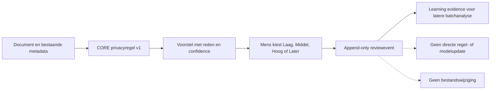

# SCRUM-99 — Privacyclassificatie in de CORE-werkset

## Doel

CORE toont privacygevoeligheid afzonderlijk van confidence. Confidence zegt hoe
zeker CORE is van een voorstel; privacy zegt hoe groot de impact van ongewenste
inzage is. Een document kan dus een lage classificatieconfidence en tegelijk
privacy `Hoog` hebben.

## Contract

De gebruikerslabels zijn `Laag`, `Middel` en `Hoog`; de stabiele codes zijn
`low`, `medium` en `high`. `document-privacy-v1` doet uitsluitend een
verklaarbaar voorstel op basis van bestaande classificatie, bestandsnaam en
padbewijs:

- paspoort, identiteit, BSN, gezondheid en authenticatiegeheimen: `Hoog`;
- financiële, fiscale, arbeids- en verzekeringsdocumenten: minimaal `Middel`;
- bestaande normale classificatie: `Laag` met middelhoge confidence;
- onvoldoende bewijs: `Middel` met lage confidence en menselijke review, nooit
  stilzwijgend `Laag`.

Het voorstel bevat level, confidence, reason-code, regelversie en gebruikte
signalen. Privacy `Hoog` staat standaard geen inhoudsoverdracht aan een externe
LLM toe. Dit veld is beleidsinput en op zichzelf nog geen toegangscontrole.

## Review en leren

SCRUM-99 hergebruikt `document_review_events`; er bestaat geen tweede
reviewsysteem. Een privacy-oordeel krijgt `review_type =
privacy_classification`. Alle menselijke oordelen zijn append-only en een nieuw
oordeel verwijst via `supersedes_event_id` naar het vorige.



De volledige historie en CSV/JSON-export bevatten zowel voorstel als menselijk
oordeel. De huidige model- of ruleversie wordt niet automatisch aangepast.

De read-only opdracht `core workset review-learning-analyze --minimum-support 3
--dry-run` groepeert de laatste privacybeoordeling per document tot inactieve
kandidaatregels. Support, agreement en tegenvoorbeelden maken zichtbaar of een
patroon voldoende consistent is voor latere menselijke refinement. De analyse
activeert geen regel, traint geen model en kan privacy `Hoog` niet automatisch
verlagen.

Dezelfde analyse controleert tevens of de bestaande CORE-voorstellen voor
categorie, documentfamilie en doelpad ongewijzigd zijn bevestigd, gecorrigeerd
of afgewezen. Zo wordt privacy-learning niet los beoordeeld van de kwaliteit
van de rest van het documentvoorstel.

## Deployment in acceptatie

Na merge en pull:

```bash
docker exec -i postgres psql -v ON_ERROR_STOP=1 -U hugo -d nasdb_test \
  < database/migrations/20260813_add_privacy_classification_review.sql
docker compose up -d --build dashboard
```

Rollback verwijdert alleen privacyreviewevents en privacykolommen; bestaande
doelpad-, categorie- en familiehistorie blijft behouden. Gebruik rollback daarom
alleen wanneer verlies van de nieuwe privacyoordelen expliciet aanvaardbaar is.
