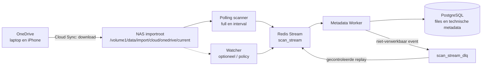
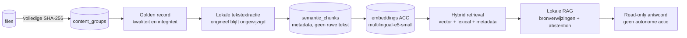
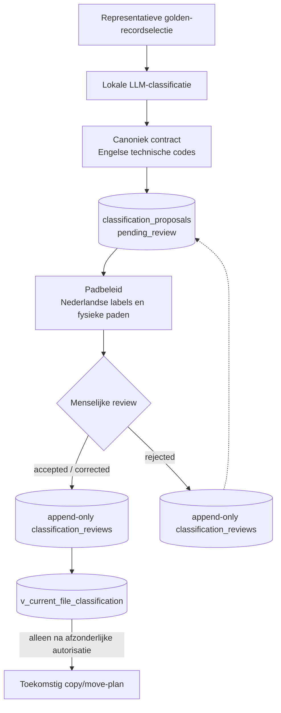
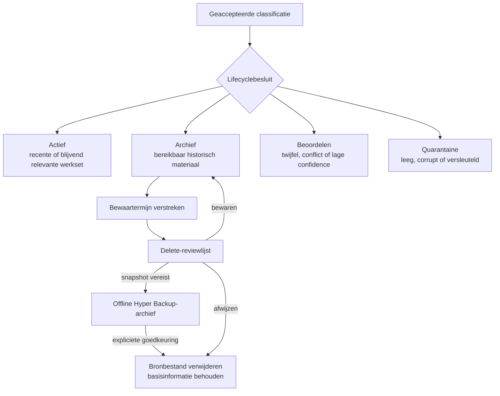
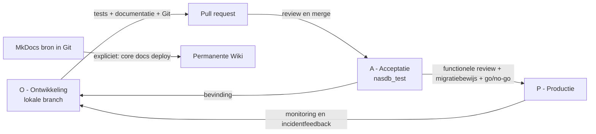

# CORE-ketendiagrammen

Deze pagina legt de belangrijkste CORE-stromen versieerbaar vast. De diagrammen
tonen de huidige acceptatieomgeving en de geplande grenzen. Een pijl betekent
niet automatisch dat een component schrijfrechten heeft; expliciete
review- en apply-stappen blijven leidend.

## Ingest en operationele metadata

OneDrive blijft de gebruiksvriendelijke werklaag. Synology Cloud Sync brengt de
geselecteerde documenten read-only de CORE-importstroom in. Scanner en watcher
zijn twee verschillende signaleringsmechanismen; Redis ontkoppelt signalering van
duurzame verwerking.

Zie ook [Scanner](scanner.md), [Metadata Worker](metadata-worker.md),
[Redis](redis.md) en [Operations](operations.md).

## Golden records en semantische verwerking

Bestandshashes bepalen exacte inhoudsgelijkheid. Golden-recordselectie kiest de
representant van een contentgroep; mutatiedatum is daarvoor niet leidend.
Extractie en embeddings zijn afgeleide, herbouwbare gegevens.

De implementatie en meetresultaten staan in
[SCRUM-59 OneDrive Semantic Pilot](../project/scrum-59-onedrive-semantic-pilot.md).

## Classificatie, review en current-view

De lokale LLM levert uitsluitend een voorstel. Technische codes blijven Engels;
Nederlandse labels en fysieke doelpaden worden via een versieerbaar padbeleid
afgeleid. Alleen het nieuwste expliciet geaccepteerde besluit voor een nog
actueel golden record verschijnt in de current-view.

Details staan in
[SCRUM-85 Persoonlijke LLM-classificatie](../project/scrum-85-personal-llm-classification.md).

## Actief, archief, review en cleanup

Classificatie en lifecycle leveren advies. Bestandsmutaties, retentie en
verwijdering zijn afzonderlijke processen met expliciete autorisatie en fallback.

Geen pijl in deze flow autoriseert op zichzelf een move of delete.

## OTAP-promotie

Ontwerp en ontwikkeling starten lokaal. Acceptatie mag gecontroleerde metadata in
de ACC-database schrijven. Productie ontvangt uitsluitend gereviewde,
reproduceerbare wijzigingen; documentatie wordt alleen op expliciet verzoek
gedeployed.

Zie [SCRUM-84](https://hugohoogendoorn.atlassian.net/browse/SCRUM-84) voor de
documentatieopdracht en [SCRUM-85](https://hugohoogendoorn.atlassian.net/browse/SCRUM-85)
voor de actieve classificatiepilot.
