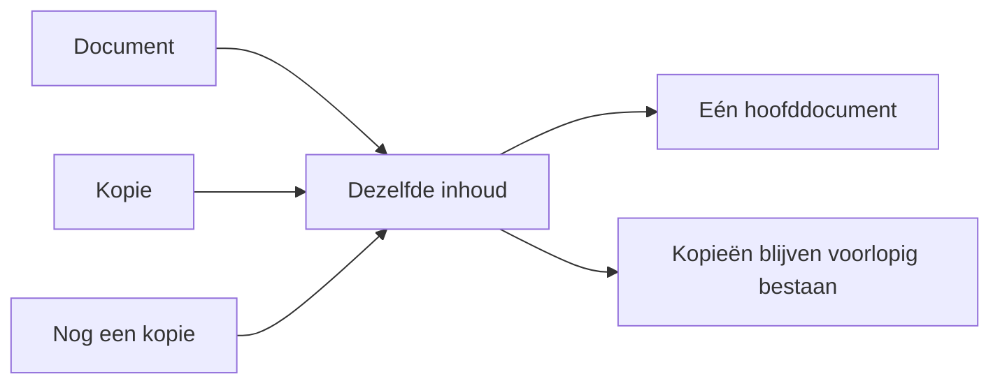
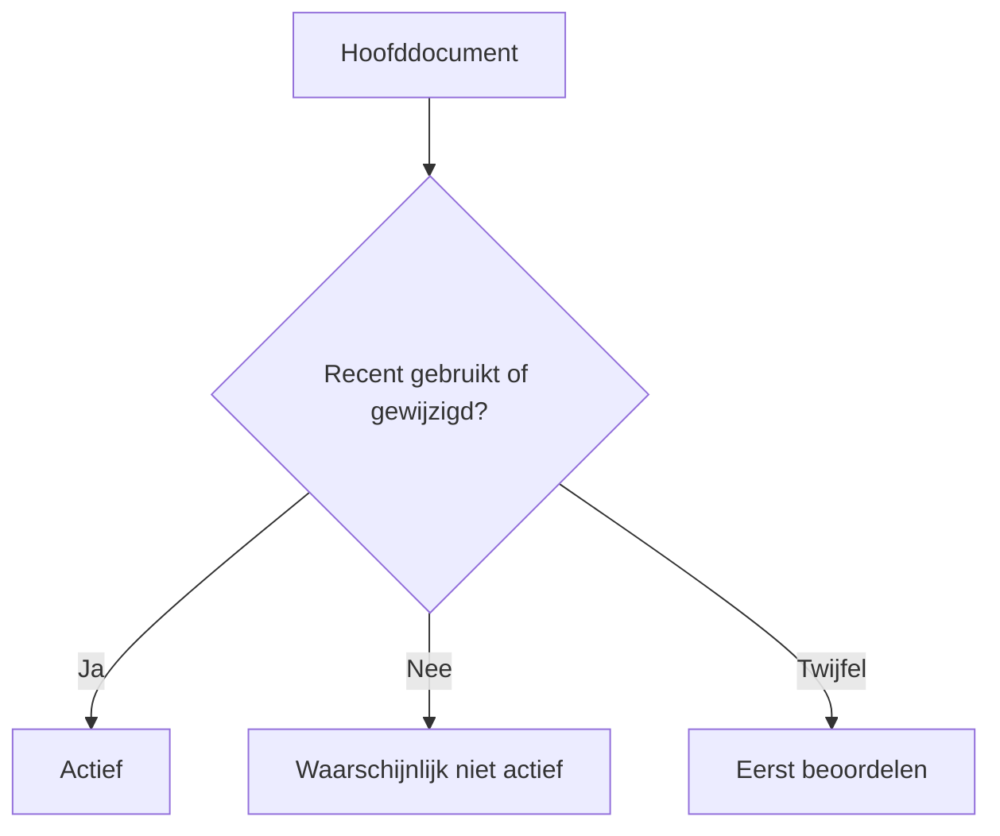
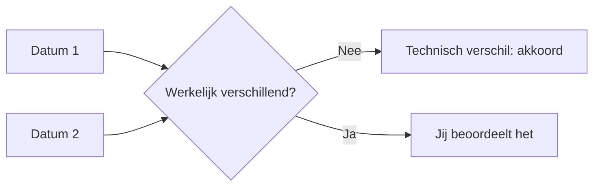
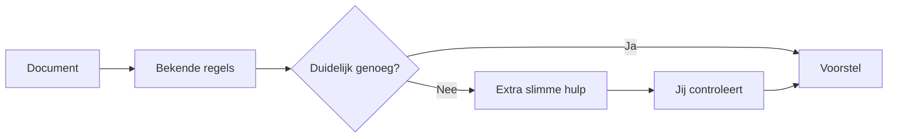
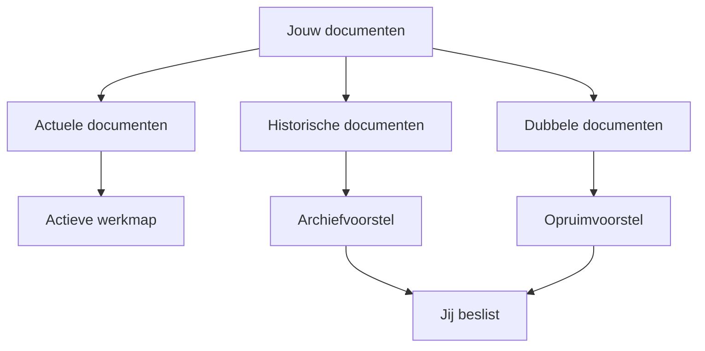

# CORE in gewone taal

CORE helpt je om overzicht te krijgen in je persoonlijke documenten.

Het kijkt welke documenten je hebt, welke dubbel zijn en welke waarschijnlijk
nog belangrijk zijn. CORE doet voorstellen, maar verandert of verwijdert niets
zonder jouw toestemming.

## Wat doet CORE nu?

CORE kan momenteel:

- documenten herkennen;
- zien welke documenten precies hetzelfde zijn;
- van gelijke documenten één hoofddocument aanwijzen;
- datums uit documenten onderzoeken;
- voorstellen welke documenten actief of verouderd zijn;
- twijfelgevallen apart zetten voor beoordeling.

## Dubbele documenten

Soms staat hetzelfde document op verschillende plekken. CORE herkent dat en
kiest één exemplaar als hoofddocument.

CORE verwijdert de kopieën nog niet. Eerst moet duidelijk zijn dat het
hoofddocument klopt en dat opruimen veilig is.

## Actieve en oude documenten

CORE kijkt momenteel negen maanden terug. Het gebruikt daarvoor betrouwbare
datums uit het document en van het bestand.

De uitkomst is een voorstel:

- **Actief:** waarschijnlijk geschikt voor je actieve werkmap.
- **Niet actief:** mogelijk geschikt voor een later archief.
- **Beoordelen:** CORE heeft onvoldoende zekerheid.

Er wordt nog niets automatisch verplaatst.

## Waarom zijn datums soms lastig?

Een document kan meerdere datums bevatten. Soms lijken die verschillend terwijl
ze eigenlijk hetzelfde moment anders opschrijven.

Bij 137 onderzochte PDF-documenten bleken 134 verschillen technisch
verklaarbaar. Er blijven daardoor nog maar 3 echte twijfelgevallen over.

## Documenten indelen

CORE kan later voorstellen:

- wat voor document het is;
- bij welke groep het hoort;
- of het actief of historisch is;
- in welke Nederlandse doelmap het zou passen.

CORE gebruikt eerst gewone regels. Alleen wanneer die onvoldoende zekerheid
geven, kan extra slimme hulp worden voorgesteld. Ook dan beslis jij.

## Het uiteindelijke doel

Het doel is een overzichtelijke actieve werkmap met daarnaast een bereikbaar
archief.

CORE moet je uiteindelijk helpen om:

1. actuele en belangrijke documenten actief te houden;
2. oude documenten bereikbaar in een archief te bewaren;
3. dubbele bestanden veilig te beoordelen;
4. zo weinig mogelijk handmatig administratief werk te doen;
5. altijd zelf controle te houden over verplaatsen en verwijderen.

## Wat werkt al?

| Onderdeel | Stand van zaken |
|---|---|
| Documenten vinden en onderzoeken | Werkt |
| Dubbele inhoud herkennen | Werkt |
| Eén hoofddocument aanwijzen | Werkt |
| Documentdatums beoordelen | Werkt |
| Actieve documenten voorstellen | Werkt in de proefomgeving |
| Documentcategorie en doelmap voorstellen | Wordt beproefd |
| Eenvoudig scherm voor jouw beoordeling | Gepland |
| Documenten naar een actieve werkmap of archief verplaatsen | Nog niet actief |
| Bestanden automatisch verwijderen | Niet toegestaan |

## De belangrijkste afspraak

CORE is dus geen programma dat zelfstandig je bestanden opruimt. Het is een
assistent die je documenten begrijpt, duidelijke voorstellen doet en jou de
controle laat houden.
