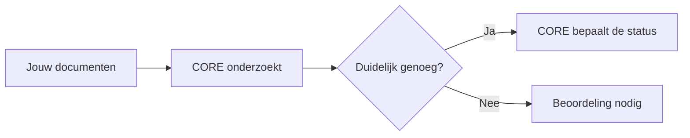
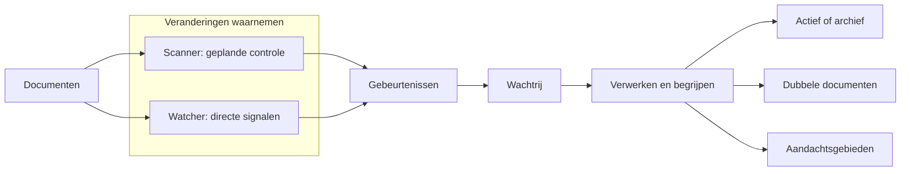
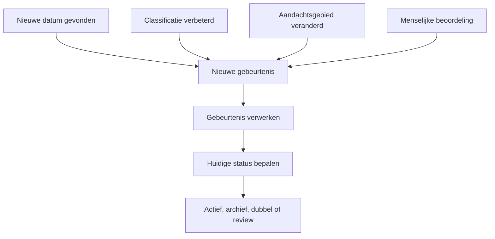
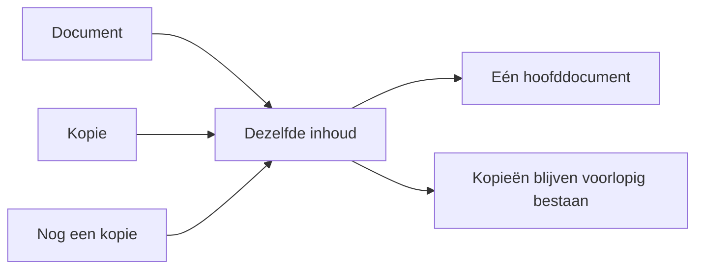
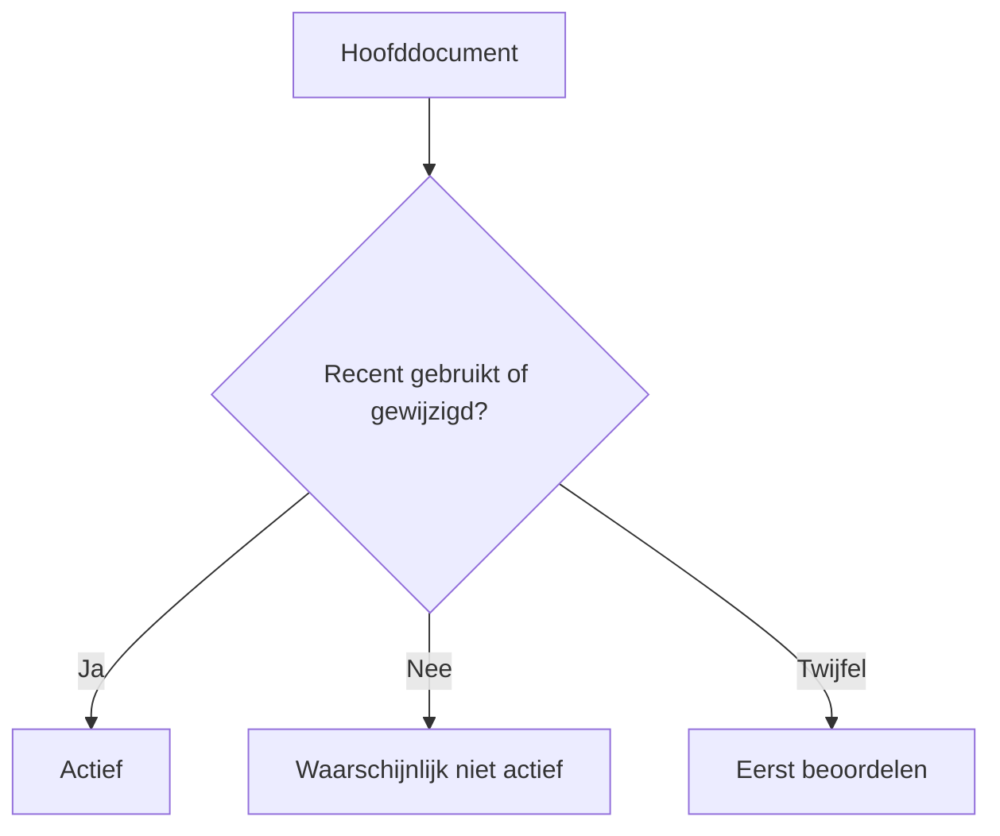
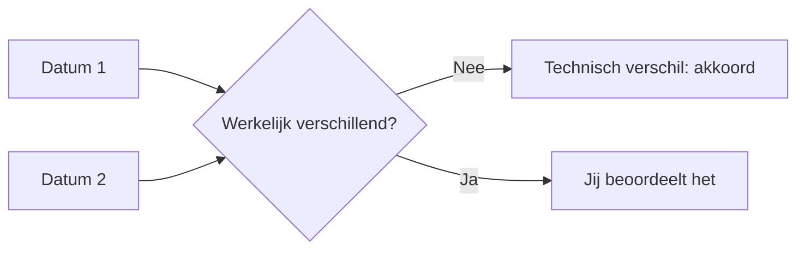
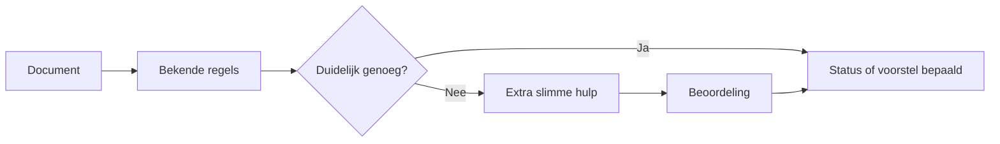
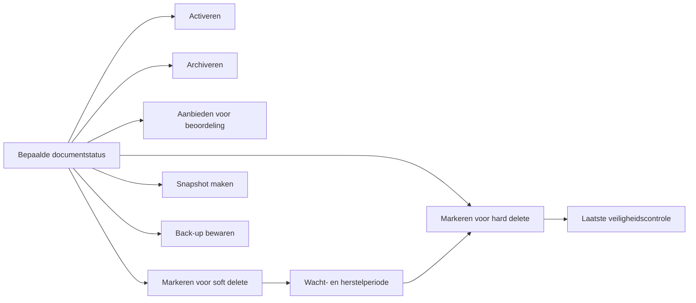
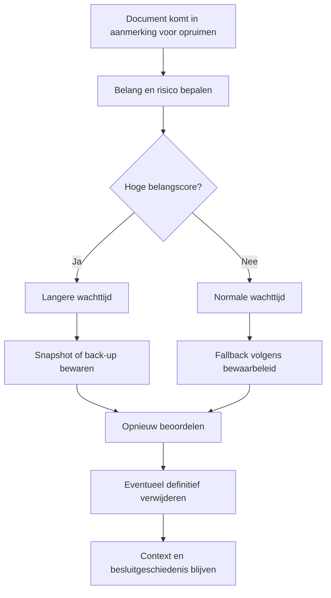
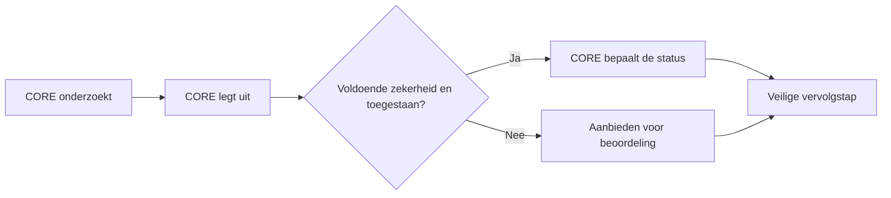

# CORE in gewone taal

CORE helpt je om overzicht te krijgen in je persoonlijke documenten.

Het kijkt welke documenten je hebt, welke dubbel zijn en welke waarschijnlijk
nog belangrijk zijn. CORE kan een uitkomst zelf bepalen wanneer de regels
duidelijk zijn. Bij twijfel of een risicovolle vervolgstap vraagt CORE om
beoordeling.

## Wat doet CORE nu?

CORE kan momenteel:

- documenten herkennen;
- zien welke documenten precies hetzelfde zijn;
- van gelijke documenten één hoofddocument aanwijzen;
- datums uit documenten onderzoeken;
- voorstellen welke documenten actief of verouderd zijn;
- twijfelgevallen apart zetten voor beoordeling.

## Hoe loopt een document door CORE?

CORE kan veranderingen op twee manieren waarnemen. De scanner controleert
documenten gepland of volledig. De watcher merkt veranderingen direct op. Ze
horen bij dezelfde functionele procesfase en maken dezelfde soort gebeurtenissen.
Een wachtrij zorgt dat die gebeurtenissen rustig kunnen worden verwerkt.

Een aandachtsgebied is bijvoorbeeld **Sollicitaties** wanneer je de laatste tijd
veel met cv's, vacatures en sollicitatiebrieven werkt. Dit maakt oude documenten
niet automatisch actief. Het is alleen extra informatie waarmee CORE relevante
documenten kan herkennen en eventueel aanbieden.

## Opnieuw beoordelen wanneer iets verandert

Sommige processen werken naast de hoofdketen. Ze kunnen nieuwe informatie
vinden, een nieuwe gebeurtenis maken en daarmee een document opnieuw laten
beoordelen.

Zo hoeft CORE niet alles iedere keer opnieuw te doen. Alleen een relevante
verandering start een nieuwe beoordeling. Iedere stap blijft terug te vinden in
de geschiedenis.

## Dubbele documenten

Soms staat hetzelfde document op verschillende plekken. CORE herkent dat en
kiest één exemplaar als hoofddocument.

CORE verwijdert de kopieën nog niet. Eerst moet duidelijk zijn dat het
hoofddocument klopt en dat opruimen veilig is.

## Actieve en oude documenten

CORE kijkt momenteel negen maanden terug. Het gebruikt daarvoor betrouwbare
datums uit het document en van het bestand.

De uitkomst is een vastgestelde status of een verzoek om beoordeling:

- **Actief:** voldoet aan de regels voor de actieve werkset.
- **Niet actief:** voldoet niet aan het actieve venster en is kandidaat voor archief.
- **Beoordelen:** CORE heeft onvoldoende zekerheid.

Er wordt nog niets automatisch verplaatst.

## Waarom zijn datums soms lastig?

Een document kan meerdere datums bevatten. Soms lijken die verschillend terwijl
ze eigenlijk hetzelfde moment anders opschrijven.

Bij 137 onderzochte PDF-documenten bleken 134 verschillen technisch
verklaarbaar. Er blijven daardoor nog maar 3 echte twijfelgevallen over.

## Documenten indelen

CORE kan later voorstellen:

- wat voor document het is;
- bij welke groep het hoort;
- of het actief of historisch is;
- in welke Nederlandse doelmap het zou passen.

CORE gebruikt eerst gewone regels. Alleen wanneer die onvoldoende zekerheid
geven, kan extra slimme hulp worden voorgesteld. De uitkomst krijgt altijd een
herkomst: bepaald door regels, voorgesteld door slimme hulp of bevestigd tijdens
een beoordeling.

## Het uiteindelijke doel

Het doel is een overzichtelijke actieve werkmap, een bereikbaar archief en een
veilige opruimketen.

**Soft delete** betekent dat een document als te verwijderen wordt gemarkeerd,
maar nog herstelbaar blijft. **Hard delete** betekent definitief verwijderen en
krijgt daarom strengere voorwaarden. Een snapshot of back-up kan als fallback
worden gemaakt voordat opslag definitief wordt vrijgegeven.

CORE mag een documentstatus automatisch bepalen wanneer een goedgekeurde regel
voldoende zekerheid geeft. Een onomkeerbare actie, zoals hard delete, blijft een
aparte stap met strengere controle en auditgeschiedenis.

## Er blijft altijd context of een fallback

Ook wanneer de volledige bestandsinhoud uiteindelijk wordt verwijderd, blijft
binnen CORE minimaal context beschikbaar. Denk aan:

- dat het document heeft bestaan;
- de naam, het type en belangrijke datums;
- de voormalige categorie en documentfamilie;
- de reden waarom het is gearchiveerd of verwijderd;
- wanneer en volgens welke regel dat gebeurde;
- eventuele relaties met andere documenten;
- de beoordeling en besluitgeschiedenis.

Afhankelijk van het belang kan daarnaast tijdelijk of langdurig een snapshot of
back-up van de inhoud worden bewaard.

Een hogere belangscore betekent dus niet automatisch dat een document actief
blijft. Het betekent wel dat CORE voorzichtiger opruimt: een langere wachttijd,
sterkere reviewvoorwaarden en vaker een snapshot of back-up. Daardoor kan een
belangrijk historisch document uit de actieve werkmap verdwijnen zonder dat het
meteen onherstelbaar verloren gaat.

CORE moet je uiteindelijk helpen om:

1. actuele en belangrijke documenten actief te houden;
2. oude documenten bereikbaar in een archief te bewaren;
3. dubbele bestanden veilig te beoordelen;
4. zo weinig mogelijk handmatig administratief werk te doen;
5. altijd zelf controle te houden over verplaatsen en verwijderen.

## Wat werkt al?

| Onderdeel | Stand van zaken |
|---|---|
| Documenten vinden en onderzoeken | Werkt |
| Dubbele inhoud herkennen | Werkt |
| Eén hoofddocument aanwijzen | Werkt |
| Documentdatums beoordelen | Werkt |
| Actieve documenten voorstellen | Werkt in de proefomgeving |
| Documentcategorie en doelmap voorstellen | Wordt beproefd |
| Eenvoudig scherm voor jouw beoordeling | Gepland |
| Documenten activeren of archiveren | Gepland |
| Markeren voor soft delete | Gepland |
| Markeren voor hard delete | Gepland, met strenge controle |
| Snapshot en back-up als fallback | Gepland |
| Bestanden werkelijk verwijderen | Nog niet actief |

## De belangrijkste afspraak

CORE hoeft dus niet voor ieder document een vraag te stellen. Het mag op basis
van goedgekeurde regels bepalen wat actief, historisch of dubbel is. Bij twijfel
of extra risico volgt beoordeling. Verwijderen blijft een afzonderlijke,
controleerbare keten met wachttijd, snapshots, back-up en auditgeschiedenis.
