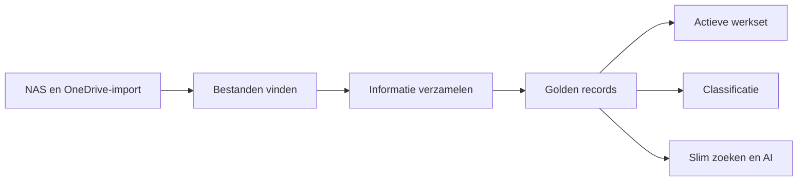
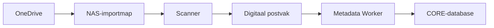
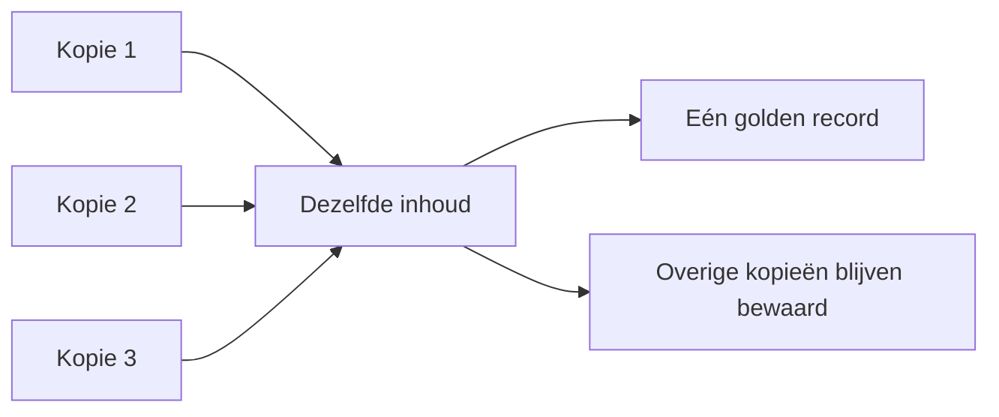
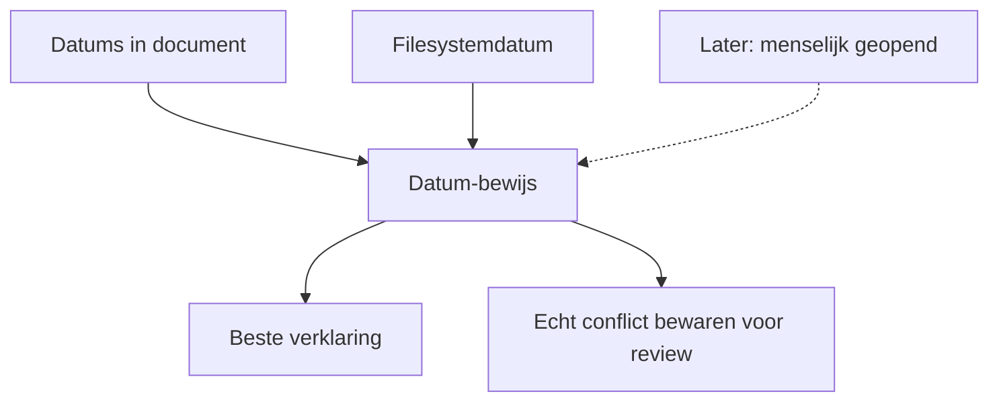
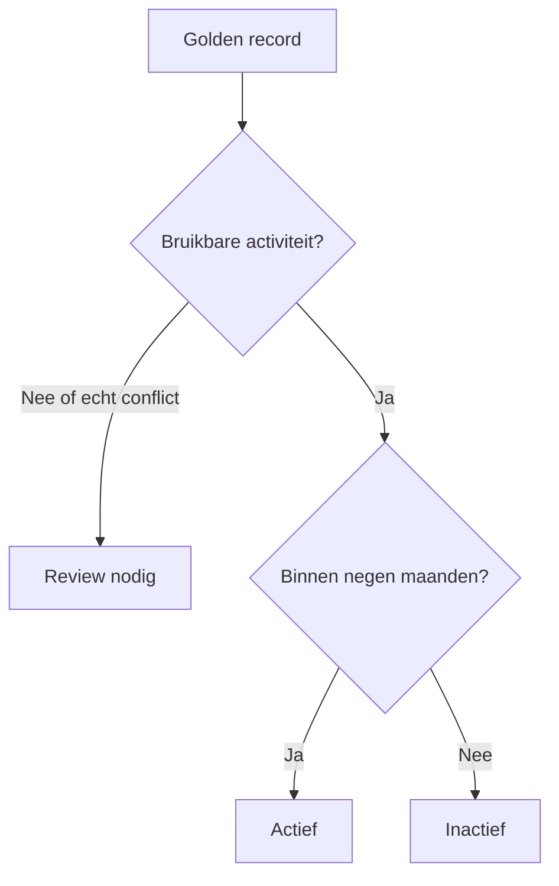
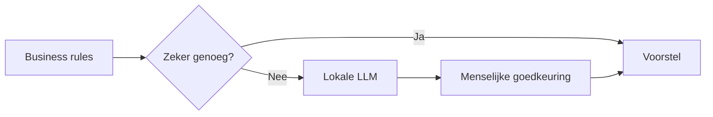
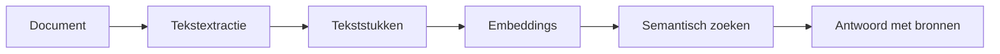
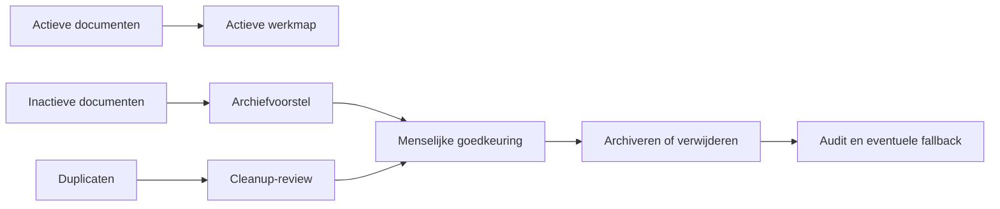
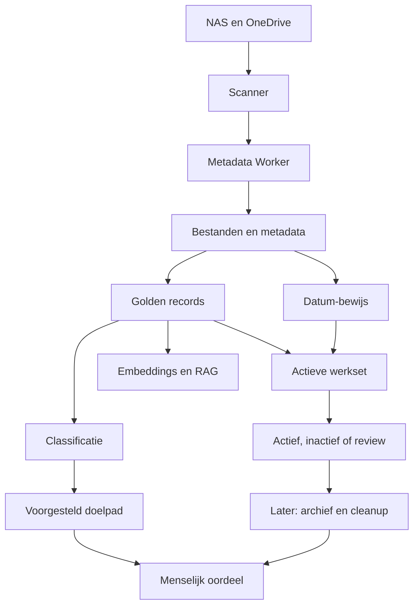

# CORE in gewone taal

Deze pagina legt zonder technische voorkennis uit wat CORE doet, wat al werkt
en welke onderdelen nog gepland zijn.

## Wat is CORE?

CORE kijkt naar je bestanden, onthoudt wat ze zijn en helpt bepalen wat
belangrijk, dubbel, actief of oud is. Het originele bestand blijft in de huidige
fase ongemoeid.

## Van OneDrive naar CORE

OneDrive synchroniseert documenten naar de tijdelijke importmap op de NAS. De
scanner vindt nieuwe en gewijzigde bestanden. De Metadata Worker verzamelt
informatie en slaat deze op in de CORE-database.

CORE bewaart onder andere de naam, het pad, bestandstype, grootte, volledige
inhoudshash, documentmetadata, documentdatums en waargenomen mutaties.

## Duplicaten en golden records

Bestanden met exact dezelfde inhoud krijgen dezelfde inhoudshash. CORE groepeert
de kopieën en kiest één golden record: de beste vertegenwoordiger van die inhoud.

De andere bestanden worden niet automatisch verwijderd. Ze blijven beschikbaar
voor controle en veilige review.

## Documentdatums begrijpen

CORE maakt onderscheid tussen een datum in het document, een filesystemdatum en
de datum waarop CORE het bestand voor het eerst zag. Die laatste datum is geen
documentaanmaakdatum.

PDF's kunnen dezelfde datum technisch verschillend opslaan. CORE herkent nu het
verschil tussen dezelfde tijd in een andere notatie en werkelijk afwijkende
datums. Van 137 onderzochte PDF-conflicten waren 134 technisch verklaarbaar;
slechts 3 bestanden blijven voor menselijke review over.

## De actieve werkset

De huidige policy kijkt negen maanden terug en beoordeelt PDF-, Word- en
Excelbestanden. Alleen actuele golden records worden gebruikt.

De database toont per document:

- `active`, `inactive` of `needs_review`;
- de reden voor het voorstel;
- de gebruikte datum en betrouwbaarheid;
- de exacte policyversie waarmee het voorstel is berekend.

CORE verplaatst of verwijdert hierbij nog niets.

## Classificatie en AI

CORE kan een categorie, documentfamilie, lifecycle en Nederlands doelpad
voorstellen. Business rules gaan voor. Een lokale LLM wordt pas voorgesteld
wanneer de regels en voorbeelden onvoldoende zekerheid geven.

AI-uitvoer verplaatst of verwijdert nooit zelfstandig bestanden.

## Slim zoeken en RAG

De lokale semantische pilot kan tekst in kleine stukken verdelen, embeddings
maken en inhoudelijk vergelijkbare documenten vinden. RAG laat een lokale LLM
antwoorden met verwijzingen naar de gebruikte documenten.

Dit werkt als acceptatiepilot, maar is niet de eerste prioriteit van het
persoonlijke-document-MVP.

## Het uiteindelijke opruimproces

De gewenste volgende fase combineert de actieve werkset, classificatie,
doelpaden, archiefvoorstellen en veilige cleanup.

De veiligheidsgrenzen blijven:

- CORE verwijdert niet zelfstandig;
- ieder voorstel bevat een uitleg;
- verplaatsen en verwijderen vereisen goedkeuring;
- belangrijke bestanden kunnen naar een offline Hyper Backup-archief;
- basisinformatie en besluitgeschiedenis blijven beschikbaar.

## Wat werkt al en wat volgt later?

| Onderdeel | Status |
|---|---|
| Scanner, metadata en mutatiehistorie | Werkt |
| Volledige hashes en golden records | Werkt |
| Append-only documentdatums | Werkt |
| Verklaarbare actieve-documentview | Werkt in acceptatie |
| PDF-datumresolutie | Gebouwd en getest; migratie na merge toepassen |
| Persoonlijke LLM-classificatie | Acceptatiepilot |
| Embeddings, retrieval en lokale RAG | Acceptatiepilot |
| Reviewportaal | Gepland |
| Automatisch archief- en cleanupvoorstel | Gepland |
| Werkelijke verplaatsing of verwijdering | Nog niet actief |

## CORE in één schema

Kort gezegd: CORE kan bestanden inmiddels inventariseren, technisch begrijpen,
duplicaten groeperen, golden records kiezen, documentdatums beoordelen en een
verklaarbare actieve werkset voorstellen. De volgende directe gebruikerswaarde
ontstaat wanneer classificatie, doelpaden en de actieve werkset samenkomen in een
eenvoudig reviewportaal.
